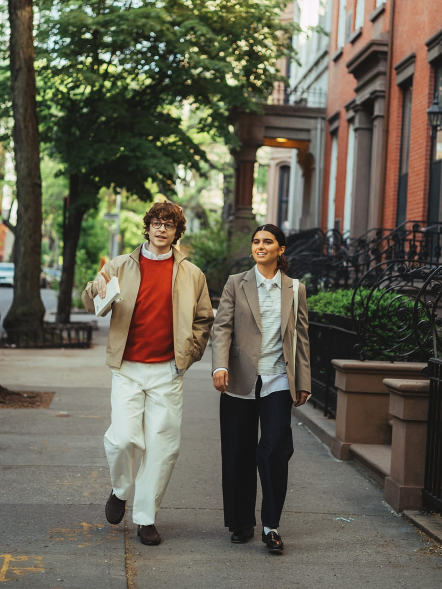
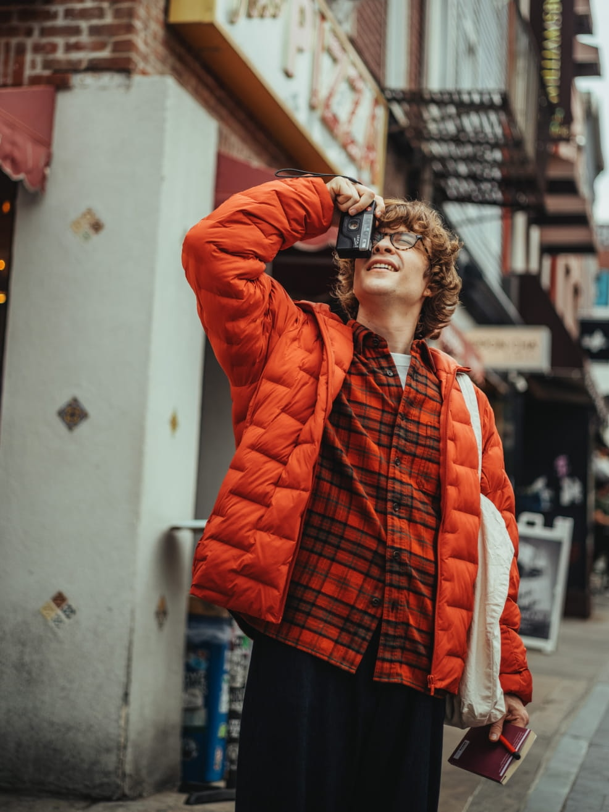
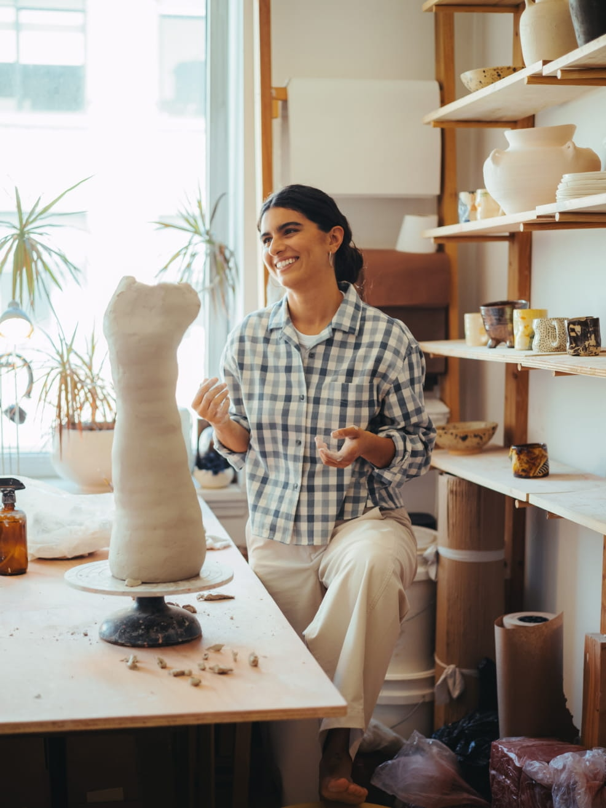
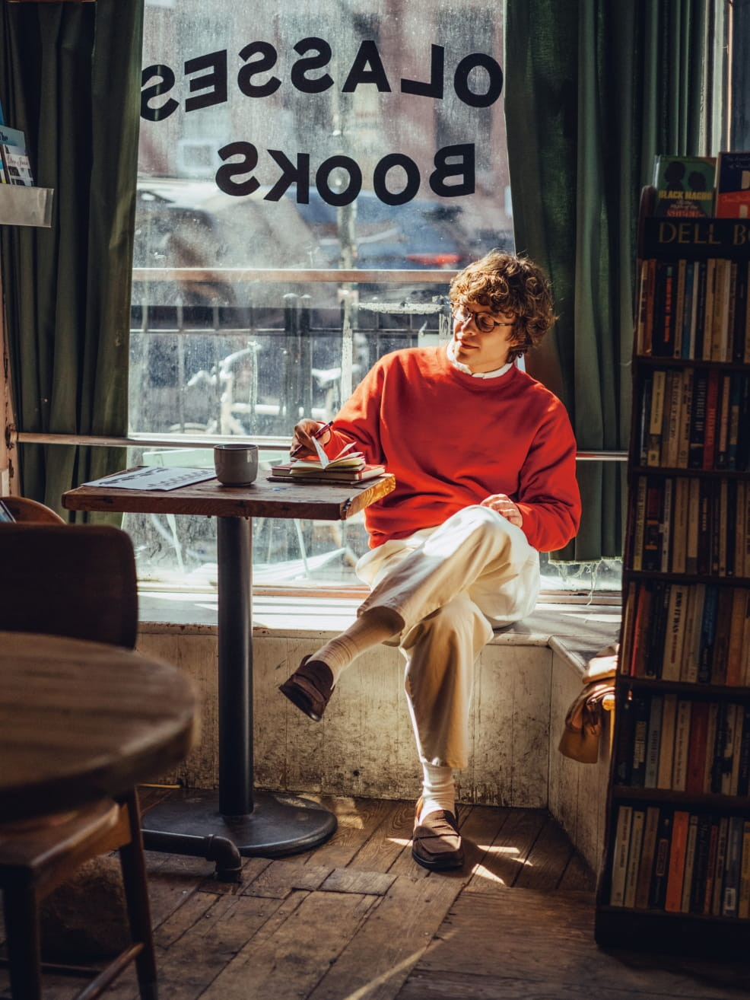
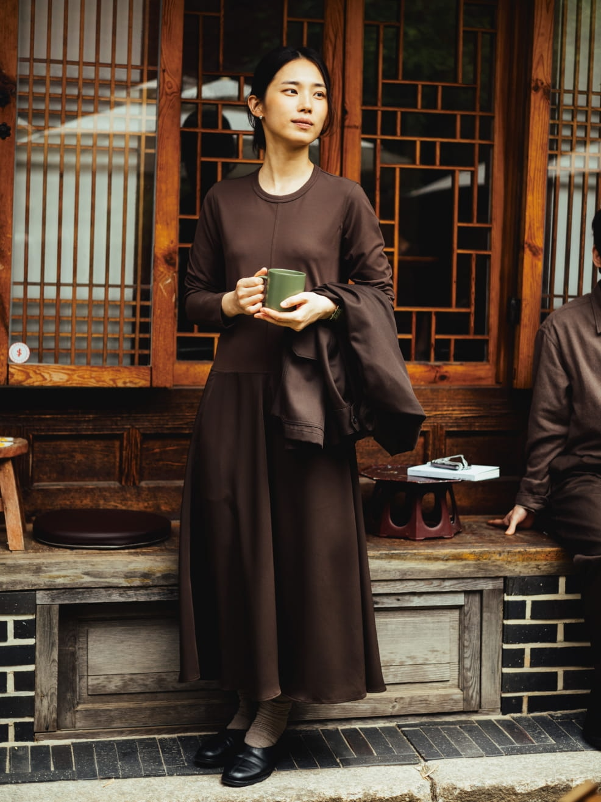
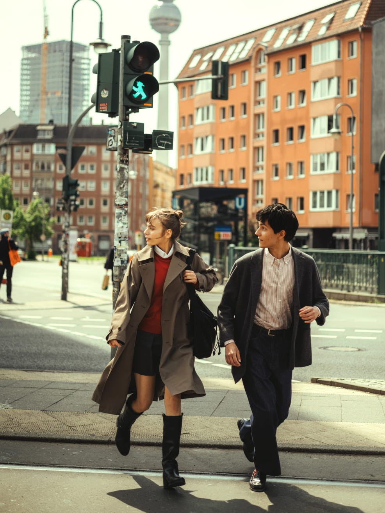
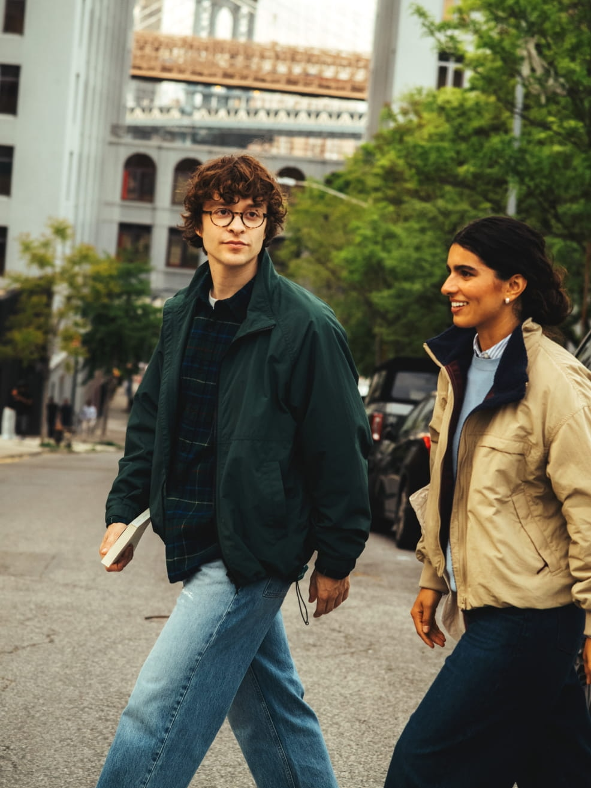

# UNIQLO LifeWear — เสื้อผ้าในจังหวะชีวิตธรรมดา

## Photo Essay

เราออกไปใช้ชีวิตด้วยเหตุผลต่างกัน บางวันมีงานให้ลงมือทำ บางวันมีสถานที่ที่อยากแวะ และบางช่วงก็ต้องการเพียงเวลาพัก

ภาพชุดนี้ชวนมองเสื้อผ้าในบริบทของคนและกิจกรรม ผ่านผู้คนในนิวยอร์ก โซล และเบอร์ลิน แต่ละภาพเป็นคนละช่วงและคนละสถานการณ์ที่นำมาเรียงใหม่ด้วยธีมร่วมกัน

### 01 — จังหวะของเมือง

**ชีวิตในเมืองมีจังหวะของมัน เราต่างเดินไปในจังหวะของตัวเอง**

เครดิตภาพ: UNIQLO LifeWear magazine / Kohei Kawashima · นิวยอร์ก · [ภาพต้นทาง 01_06.jpg](https://image.uniqlo.com/UQ/ST3/jp/imagesother/LifeWear_magazine/26FW/03/01_06.jpg)

### 02 — สีที่เราเลือก

**บางวันเราเติมสีให้วันธรรมดา ด้วยสิ่งเล็ก ๆ ที่เลือกเอง**

เครดิตภาพ: UNIQLO LifeWear magazine / Kohei Kawashima · นิวยอร์ก · [ภาพต้นทาง 01_02.jpg](https://image.uniqlo.com/UQ/ST3/jp/imagesother/LifeWear_magazine/26FW/03/01_02.jpg)

### 03 — พื้นที่ของการลงมือทำ

**ในพื้นที่ของการลงมือทำ เสื้อผ้าก็เป็นส่วนหนึ่งของเรื่องราว**

เครดิตภาพ: UNIQLO LifeWear magazine / Kohei Kawashima · นิวยอร์ก · [ภาพต้นทาง 01_04.jpg](https://image.uniqlo.com/UQ/ST3/jp/imagesother/LifeWear_magazine/26FW/03/01_04.jpg)

### 04 — พื้นที่สำหรับสิ่งที่ชอบ

**ระหว่างสิ่งที่ต้องทำ ยังมีพื้นที่สำหรับสิ่งที่ชอบ**

เครดิตภาพ: UNIQLO LifeWear magazine / Kohei Kawashima · นิวยอร์ก · [ภาพต้นทาง 01_05.jpg](https://image.uniqlo.com/UQ/ST3/jp/imagesother/LifeWear_magazine/26FW/03/01_05.jpg)

### 05 — ตัวเราในสถานที่ใหม่

**สถานที่เปลี่ยนไป แต่เรายังเลือกแสดงตัวตนในแบบของเรา**

เครดิตภาพ: UNIQLO LifeWear magazine / Kohei Kawashima · โซล · [ภาพต้นทาง 02_01.jpg](https://image.uniqlo.com/UQ/ST3/jp/imagesother/LifeWear_magazine/26FW/03/02_01.jpg)

### 06 — เวลาพัก

**การพักก็เป็นอีกจังหวะหนึ่งของชีวิต ไม่ต้องรีบไปข้างหน้าตลอดเวลา**

เครดิตภาพ: UNIQLO LifeWear magazine / Kohei Kawashima · โซล · [ภาพต้นทาง 02_05.jpg](https://image.uniqlo.com/UQ/ST3/jp/imagesother/LifeWear_magazine/26FW/03/02_05.jpg)

### 07 — เดินไปด้วยกัน

**บางเส้นทางเราเดินไปด้วยกัน โดยแต่ละคนยังมีสไตล์ของตัวเอง**

เครดิตภาพ: UNIQLO LifeWear magazine / Kohei Kawashima · เบอร์ลิน · [ภาพต้นทาง 03_04.jpg](https://image.uniqlo.com/UQ/ST3/jp/imagesother/LifeWear_magazine/26FW/03/03_04.jpg)

### 08 — เรื่องราวในวันธรรมดา

**วันธรรมดามีเรื่องราวเสมอ และเสื้อผ้าก็อยู่ในเรื่องราวนั้น**

เครดิตภาพ: UNIQLO LifeWear magazine / Kohei Kawashima · นิวยอร์ก · [ภาพต้นทาง 01_01.jpg](https://image.uniqlo.com/UQ/ST3/jp/imagesother/LifeWear_magazine/26FW/03/01_01.jpg)

### สารที่อยากฝากไว้

**เสื้อผ้าที่เรียบง่ายเป็นส่วนหนึ่งของชีวิตที่เราเลือกใช้ในแบบของเรา**

ลองมองกิจกรรมหนึ่งในชีวิตประจำวันของคุณ แล้วถามว่า เสื้อผ้าที่คุณเลือกอยู่ในเรื่องราวนั้นอย่างไร

---

## เกี่ยวกับร่างผลงาน

**รูปแบบ:** Photo Essay / Visual Storytelling จำนวน 8 ภาพ  
**ชื่อโครงงาน:** UNIQLO LifeWear — เสื้อผ้าในจังหวะชีวิตธรรมดา  
**กลุ่มเป้าหมายที่ออกแบบไว้:** นักศึกษาและวัยเริ่มงานประมาณ 18–30 ปี  
**Big Idea:** มองเสื้อผ้าผ่านกิจกรรมและจังหวะชีวิตของผู้สวมใส่  
**Key Message:** เสื้อผ้าที่เรียบง่ายเป็นส่วนหนึ่งของชีวิตที่เราเลือกใช้ในแบบของเรา  
**ประเภทการเล่า:** Brand Storytelling ผ่านภาพและคำบรรยายเชิงธีม  
**สถานะ:** ร่าง MD พร้อมภาพต้นฉบับดาวน์โหลด ยังไม่ได้เผยแพร่หรือทดลองกับผู้ชม  
**วันที่จัดทำร่างและเข้าถึงแหล่งภาพ:** 1 ตุลาคม 2569 (2026-10-01)

กลุ่มเป้าหมายเป็นข้อกำหนดสำหรับการออกแบบ ส่วน Insight และ Persona ใน Report / Slides เป็นสมมติฐานที่ยังไม่ได้ตรวจด้วยข้อมูลผู้ชมจริง

ภาพทั้งหมดมาจาก [The City Classics](https://www.uniqlo.com/th/th/special-feature/lifewear-magazine/26fw/the-city-classics) ใน UNIQLO LifeWear magazine ฉบับฤดูใบไม้ร่วงและฤดูหนาว 2026 หน้าต้นทางให้เครดิตภาพแก่ **Kohei Kawashima** ส่วนลำดับเรื่อง ชื่อช่วง บทเปิด และคำบรรยายภาษาไทยในร่างนี้จัดทำขึ้นใหม่

คำบรรยายเป็นการตีความเชิงธีม ไม่ใช่คำพูด ความรู้สึก หรือข้อมูลการใช้ชีวิตที่บุคคลในภาพให้สัมภาษณ์ ภาพข้ามเมืองไม่ได้แสดงความต่อเนื่องของวันเดียวกัน

แนวคิด LifeWear ที่ใช้เป็นฐานมาจาก [คำอธิบายของ UNIQLO](https://www.uniqlo.com/us/en/special-feature/lifewear-magazine/about) ซึ่งกล่าวถึงเสื้อผ้าสำหรับชีวิตประจำวัน ร่างนี้ไม่ได้ทดสอบคุณสมบัติสินค้า ความสบาย หรือผลต่อพฤติกรรมการซื้อ

งานนี้เป็นร่างโครงงานเพื่อการศึกษาโดยใช้ภาพคัดสรร ไม่ใช่งานที่ UNIQLO มอบหมาย ภาพยังมีลิขสิทธิ์ของต้นทาง การมีเครดิตไม่ใช่หลักฐานอนุญาตเผยแพร่ใหม่ และร่างนี้ยังไม่มีเอกสารยืนยันสิทธิ์การนำภาพไปโพสต์ซ้ำ

**การใช้ AI:** ใช้ Codex ช่วยค้นและตรวจแหล่งข้อมูล จัดลำดับ ร่างคำบรรยาย และสร้าง MD ไม่ได้ใช้ AI Generate หรือแก้ไขภาพ คน เสื้อผ้า และฉากในภาพยังเป็นต้นฉบับ

---

## Storyboard พร้อมภาพ

ลำดับนี้เป็นการออกแบบ Photo Essay ไม่ใช่แผนถ่ายวิดีโอ จังหวะเกิดจากการสลับกิจกรรม พื้นที่ สี และความใกล้ชิดของคนในภาพ เส้นเรื่องแบ่งเป็นช่วงเปิด P01–P02, ช่วงขยาย P03–P06 และช่วงปิด P07–P08

| ช่องภาพ | หน้าที่ อารมณ์ และเหตุผลการเรียง |
|---|---|
| **SB01 / P01 — จังหวะของเมือง**  | **หน้าที่:** ตั้งบริบทการใช้ชีวิตในเมือง **อารมณ์:** เคลื่อนไหว เป็นธรรมชาติ **เหตุผล:** เริ่มด้วยคนและพื้นที่ก่อนอธิบายแนวคิดเรื่องเสื้อผ้า **คำบรรยาย:** ชีวิตในเมืองมีจังหวะของมัน เราต่างเดินไปในจังหวะของตัวเอง |
| **SB02 / P02 — สีที่เราเลือก**  | **หน้าที่:** เปลี่ยนจากบริบทเมืองสู่การเลือกของบุคคล **อารมณ์:** สดใส มีตัวตน **เหตุผล:** สีส้มที่เห็นจริงเป็นจุดพักสายตาและช่วยเปิดเรื่องการแสดงตัวตน **คำบรรยาย:** บางวันเราเติมสีให้วันธรรมดา ด้วยสิ่งเล็ก ๆ ที่เลือกเอง |
| **SB03 / P03 — พื้นที่ของการลงมือทำ**  | **หน้าที่:** เชื่อมเสื้อผ้ากับกิจกรรมที่เห็นในภาพ **อารมณ์:** ตั้งใจ อบอุ่น **เหตุผล:** ขยายเรื่องให้เห็นการใช้งานในพื้นที่สร้างสรรค์ แทนการดูเสื้อผ้าอย่างเดียว **คำบรรยาย:** ในพื้นที่ของการลงมือทำ เสื้อผ้าก็เป็นส่วนหนึ่งของเรื่องราว |
| **SB04 / P04 — พื้นที่สำหรับสิ่งที่ชอบ**  | **หน้าที่:** เพิ่มช่วงส่วนตัวในพื้นที่ร้านหนังสือ **อารมณ์:** ผ่อนจังหวะ เปิดพื้นที่ให้ความสนใจ **เหตุผล:** สลับจากภาพกำลังทำงานเป็นภาพนั่ง เพื่อไม่ให้เรื่องมีจังหวะเดียวตลอด **คำบรรยาย:** ระหว่างสิ่งที่ต้องทำ ยังมีพื้นที่สำหรับสิ่งที่ชอบ |
| **SB05 / P05 — ตัวเราในสถานที่ใหม่**  | **หน้าที่:** ขยายธีมไปยังคนและเมืองอื่น **อารมณ์:** สงบ เรียบง่าย **เหตุผล:** พื้นที่สถาปัตยกรรมและโทนภาพต่างจากสี่ภาพแรก ช่วยให้เห็นธีมร่วมโดยไม่ทำให้เป็นเรื่องของคนเดียว **คำบรรยาย:** สถานที่เปลี่ยนไป แต่เรายังเลือกแสดงตัวตนในแบบของเรา |
| **SB06 / P06 — เวลาพัก**  | **หน้าที่:** ให้เรื่องมีช่วงพักก่อนเข้าสู่บทปิด **อารมณ์:** นุ่มนวล ไม่เร่งรีบ **เหตุผล:** การถือถ้วยและพื้นที่คาเฟ่รองรับคำบรรยายเรื่องการพัก โดยไม่แต่งเหตุการณ์ก่อนหรือหลังภาพ **คำบรรยาย:** การพักก็เป็นอีกจังหวะหนึ่งของชีวิต ไม่ต้องรีบไปข้างหน้าตลอดเวลา |
| **SB07 / P07 — เดินไปด้วยกัน**  | **หน้าที่:** เปลี่ยนจากพื้นที่ส่วนตัวสู่การอยู่ร่วมกับผู้อื่น **อารมณ์:** เคลื่อนไหว เชื่อมโยง **เหตุผล:** ภาพคู่คนข้ามถนนนำการเคลื่อนไหวกลับมา และเตรียมกลับสู่ภาพคู่ในบทปิด **คำบรรยาย:** บางเส้นทางเราเดินไปด้วยกัน โดยแต่ละคนยังมีสไตล์ของตัวเอง |
| **SB08 / P08 — เรื่องราวในวันธรรมดา**  | **หน้าที่:** ปิดวงเรื่องด้วยคนและเมือง พร้อมย้ำ Key Message **อารมณ์:** เป็นกันเอง เปิดให้ผู้ชมเชื่อมกับชีวิตตนเอง **เหตุผล:** กลับสู่ภาพคู่ในนิวยอร์ก ทำให้ลำดับมีภาพเปิด–ปิดที่สัมพันธ์กันโดยไม่อ้างความต่อเนื่องด้านเวลา **คำบรรยาย:** วันธรรมดามีเรื่องราวเสมอ และเสื้อผ้าก็อยู่ในเรื่องราวนั้น |

### แนวจัดวางเมื่อพัฒนาเป็น Carousel

แผนเสนอใช้ Instagram Carousel 8 ภาพ โดยหนึ่งภาพเป็นหนึ่งช่วงเรื่อง คงลำดับ P01–P08 และใช้ข้อความสั้นเท่าที่อ่านได้บนโทรศัพท์ ไม่ใส่คำบรรยายทับคนหรือเสื้อผ้าหลัก

ภาพต้นฉบับมีอัตราส่วนใกล้ 3:4 ขณะนี้ยังไม่ได้ครอป ทำกรอบ หรือส่งออก Carousel หากต้องปรับเป็น 4:5 ให้จัดบนพื้นที่ที่รองรับภาพเต็มโดยรักษาสัดส่วนและไม่ตัดองค์ประกอบสำคัญ ตรวจตัวอย่างจริงก่อนส่งออก

แนวงานใช้พื้นขาว ตัวอักษรสีเข้ม และพื้นที่ว่าง ภาพมีสีและบรรยากาศของตัวเองอยู่แล้ว จึงไม่เพิ่มฟิลเตอร์หรือสร้างฉากใหม่

---

## ทะเบียนภาพและแหล่งที่มา

ต้นทางร่วมทุกภาพ: [The City Classics — UNIQLO TH](https://www.uniqlo.com/th/th/special-feature/lifewear-magazine/26fw/the-city-classics)  
ช่างภาพที่ต้นทางระบุ: **Kohei Kawashima**  
เจ้าของเนื้อหาต้นทาง: **UNIQLO LifeWear magazine**  
วันที่เข้าถึงและดาวน์โหลด: **2026-10-01**  
ขนาดทุกภาพ: **986 × 1314 px, JPEG**  
ตำแหน่งเก็บ: `assets/uniqlo-lifewear/`

| รหัส | ชื่อไฟล์ในโครงงาน | URL ภาพต้นฉบับ | หน้าต้นทาง / บริบท | ช่างภาพ | วันที่เข้าถึง |
|---|---|---|---|---|---|
| P01 | P01_city_walk.jpg | [01_06.jpg](https://image.uniqlo.com/UQ/ST3/jp/imagesother/LifeWear_magazine/26FW/03/01_06.jpg) | [The City Classics](https://www.uniqlo.com/th/th/special-feature/lifewear-magazine/26fw/the-city-classics), นิวยอร์ก | Kohei Kawashima | 2026-10-01 |
| P02 | P02_color_identity.jpg | [01_02.jpg](https://image.uniqlo.com/UQ/ST3/jp/imagesother/LifeWear_magazine/26FW/03/01_02.jpg) | [The City Classics](https://www.uniqlo.com/th/th/special-feature/lifewear-magazine/26fw/the-city-classics), นิวยอร์ก | Kohei Kawashima | 2026-10-01 |
| P03 | P03_creative_work.jpg | [01_04.jpg](https://image.uniqlo.com/UQ/ST3/jp/imagesother/LifeWear_magazine/26FW/03/01_04.jpg) | [The City Classics](https://www.uniqlo.com/th/th/special-feature/lifewear-magazine/26fw/the-city-classics), นิวยอร์ก | Kohei Kawashima | 2026-10-01 |
| P04 | P04_personal_interest.jpg | [01_05.jpg](https://image.uniqlo.com/UQ/ST3/jp/imagesother/LifeWear_magazine/26FW/03/01_05.jpg) | [The City Classics](https://www.uniqlo.com/th/th/special-feature/lifewear-magazine/26fw/the-city-classics), นิวยอร์ก | Kohei Kawashima | 2026-10-01 |
| P05 | P05_city_identity.jpg | [02_01.jpg](https://image.uniqlo.com/UQ/ST3/jp/imagesother/LifeWear_magazine/26FW/03/02_01.jpg) | [The City Classics](https://www.uniqlo.com/th/th/special-feature/lifewear-magazine/26fw/the-city-classics), โซล | Kohei Kawashima | 2026-10-01 |
| P06 | P06_quiet_pause.jpg | [02_05.jpg](https://image.uniqlo.com/UQ/ST3/jp/imagesother/LifeWear_magazine/26FW/03/02_05.jpg) | [The City Classics](https://www.uniqlo.com/th/th/special-feature/lifewear-magazine/26fw/the-city-classics), โซล | Kohei Kawashima | 2026-10-01 |
| P07 | P07_walk_together.jpg | [03_04.jpg](https://image.uniqlo.com/UQ/ST3/jp/imagesother/LifeWear_magazine/26FW/03/03_04.jpg) | [The City Classics](https://www.uniqlo.com/th/th/special-feature/lifewear-magazine/26fw/the-city-classics), เบอร์ลิน | Kohei Kawashima | 2026-10-01 |
| P08 | P08_everyday_life.jpg | [01_01.jpg](https://image.uniqlo.com/UQ/ST3/jp/imagesother/LifeWear_magazine/26FW/03/01_01.jpg) | [The City Classics](https://www.uniqlo.com/th/th/special-feature/lifewear-magazine/26fw/the-city-classics), นิวยอร์ก | Kohei Kawashima | 2026-10-01 |

**สถานะการใช้ภาพ:** เป็นภาพจากแหล่งทางการที่มีลิขสิทธิ์ ไม่ได้ยืนยันว่าเป็นภาพเปิดใช้ฟรีหรือได้รับอนุญาตให้เผยแพร่ซ้ำ เก็บเครดิตและ URL เพื่อให้ตรวจที่มาได้

## เอกสารประกอบ

- [Report ฉบับร่าง](Uniqlo_LifeWear_Report_Draft.md)
- [Slides ฉบับร่าง](Uniqlo_LifeWear_Slides_Draft.md)

## สิ่งที่ยังต้องทำก่อนส่งหรือเผยแพร่จริง

- เติมข้อมูลรายวิชาและสมาชิกจริงใน Report / Slides และให้สมาชิกตรวจเนื้อหา
- ตรวจข้อกำหนดผู้สอนเรื่องการใช้ภาพคัดสรร หากต้องใช้ภาพถ่ายเองต้องจัดทำงานภาพใหม่
- ยืนยันเงื่อนไขการใช้ภาพก่อนนำไปโพสต์ใหม่; ยังไม่มีการเผยแพร่สาธารณะในร่างนี้
- ทดลองให้ผู้ชมอ่านครบ 8 ภาพและเก็บคำตอบจริงตามแผนใน Report 5.4
- หากจะเผยแพร่ Carousel ให้จัดหน้า ส่งออก และตรวจเครดิตในไฟล์ภาพจริงก่อนโพสต์
