# รายงานโครงงาน Digital Storytelling Project

## ปกหน้า

**ชื่อโครงงาน:** UNIQLO LifeWear — เสื้อผ้าในจังหวะชีวิตธรรมดา  
**รูปแบบผลงาน:** Photo Essay / Visual Storytelling จำนวน 8 ภาพ  
**รายวิชา:** BS932116 Storytelling for Digital Communication  
**ชื่อรายวิชาภาษาไทย:** การเล่าเรื่องสำหรับการสื่อสารทางดิจิทัล  
**อาจารย์ผู้สอน:** ผศ.ดร.กัมปนาท ศิริโยธา  
**วันที่จัดทำร่างแรก:** 1 ตุลาคม 2569  
**วันที่ปรับตามสไลด์:** 5 ตุลาคม 2569

| ลำดับ | รหัสนักศึกษา | ชื่อ–สกุล |
|---|---|---|
| 1 | 673210269-9 | พนัสชัย แก้วสอนดี |
| 2 | 673210575-2 | จักรพันธ์ อะวิสัย |
| 3 | 673210585-9 | ปราณปริยา เวชกามา |
| 4 | 673210844-1 | ปรมัตถ์ ทัศณรงค์ |
| 5 | 673210268-1 | ปุรัสกร อ้วนพรมมา |
| 6 | 673210836-0 | ณดล วิทักษบุตร |

ชื่อและรหัสใช้ข้อมูลที่ผู้จัดทำให้เมื่อวันที่ 5 ตุลาคม 2569

## ข้อมูลฉบับร่าง

| รายการ | สถานะ |
|---|---|
| ฉบับเอกสาร | ปรับตาม STORYTELLING.pdf และข้อมูลกลุ่ม วันที่ 5 ตุลาคม 2569 |
| ผลงานที่มี | Photo Essay 8 ภาพ พร้อม Storyboard, Report และสไลด์ PDF 29 หน้า |
| ช่องทางอ่าน | [GitHub Public](https://github.com/uhactuallyidk/uniqlo-lifewear-photo-essay) |
| ข้อมูลผู้ชม | Insight และ Persona เป็นสมมติฐาน; ผลทดลองยังรอเก็บ |
| ข้อมูลที่รอเติม | วันที่ส่ง ผลทดลอง และบันทึกตรวจฉบับส่ง |

รายงานคงโครง 6 บท 34 หัวข้อตามเทมเพลตรายงานเดิม โดยใช้ STORYTELLING.pdf เป็นแหล่งรายละเอียดการนำเสนอ ภาพที่วางไว้มีคำบรรยายและหน้าต้นทาง ส่วนคำแนะนำจัดภาพและตารางเทียบเทมเพลตท้ายเอกสารเป็นคู่มือผู้จัดทำที่ลบออกได้ก่อนส่ง ขอบเขต AI และสถานะสิทธิ์ภาพอยู่ในบทที่ 6

---

# คำนำ

รายงานฉบับนี้จัดทำขึ้นเป็นส่วนหนึ่งของรายวิชา BS932116 การเล่าเรื่องสำหรับการสื่อสารทางดิจิทัล เพื่ออธิบายการออกแบบโครงงาน “UNIQLO LifeWear — เสื้อผ้าในจังหวะชีวิตธรรมดา” ในรูปแบบ Photo Essay / Visual Storytelling จำนวน 8 ภาพ โครงงานนำภาพจากแหล่งทางการของ UNIQLO มาเรียงใหม่ด้วยธีมชีวิตประจำวัน พร้อมคำบรรยายภาษาไทยที่จัดทำขึ้นสำหรับโครงงาน

เนื้อหาครอบคลุมที่มา วัตถุประสงค์ สมมติฐานเกี่ยวกับกลุ่มเป้าหมาย แนวคิดหลัก การออกแบบลำดับภาพ กระบวนการจัดทำร่าง แผนเผยแพร่และวัดผล ตลอดจนที่มาของสื่อ การใช้ AI และบทเรียนจากการออกแบบและการทำงานที่กลุ่มสะท้อนในสไลด์ ผลงานปัจจุบันมีฉบับ Markdown พร้อมภาพต้นฉบับและเอกสารนำเสนอ STORYTELLING.pdf จำนวน 29 หน้า การประเมินเชิงบรรณาธิการแยกจากผลทดลองผู้ชมซึ่งยังรอเก็บ

คณะผู้จัดทำ  
[ระบุวันที่ส่งรายงานจริง]

---

# สารบัญ

เมื่อจัดเอกสารส่ง ให้สร้างสารบัญพร้อมเลขหน้าจากฉบับสุดท้าย รายการด้านล่างคงเลขหัวข้อย่อยตามเทมเพลตผู้สอน

- บทที่ 1 บทนำ
  - 1.1 ที่มาและความสำคัญของโครงงาน
  - 1.2 วัตถุประสงค์การสื่อสาร
  - 1.3 ขอบเขตของโครงงาน
  - 1.4 ประโยชน์ที่คาดว่าจะได้รับ
- บทที่ 2 การวิเคราะห์กลุ่มเป้าหมายและแนวคิดหลัก
  - 2.1 กลุ่มเป้าหมายของโครงงาน
  - 2.2 พฤติกรรมการใช้สื่อของกลุ่มเป้าหมาย
  - 2.3 Audience Insight
  - 2.4 Persona ของกลุ่มเป้าหมาย
  - 2.5 แนวคิดหลักของเรื่อง
  - 2.6 สารหลักของเรื่อง
- บทที่ 3 การออกแบบเรื่องเล่า
  - 3.1 ประเภทของการเล่าเรื่องที่ใช้
  - 3.2 โครงสร้างเรื่องเล่า
  - 3.3 ตัวละครหรือผู้เล่าเรื่อง
  - 3.4 ความขัดแย้งหรือปัญหาหลัก
  - 3.5 อารมณ์และบรรยากาศของเรื่อง
  - 3.6 Storyboard / Script / Content Plan
- บทที่ 4 กระบวนการผลิตผลงาน
  - 4.1 รูปแบบสื่อที่เลือกใช้
  - 4.2 เหตุผลในการเลือกแพลตฟอร์ม
  - 4.3 ขั้นตอนการผลิตผลงาน
  - 4.4 เครื่องมือที่ใช้ในการผลิต
  - 4.5 บทบาทและหน้าที่ของสมาชิกกลุ่ม
  - 4.6 ปัญหา อุปสรรค และแนวทางแก้ไข
- บทที่ 5 ผลงาน แผนเผยแพร่ และการวัดผล
  - 5.1 รายละเอียดผลงาน Digital Storytelling
  - 5.2 Link หรือ QR Code ผลงาน
  - 5.3 แผนการเผยแพร่ผลงาน
  - 5.4 แนวทางการวัดผล
  - 5.5 ผลลัพธ์หรือผลตอบรับเบื้องต้น
  - 5.6 การประเมินคุณภาพผลงานของกลุ่ม
- บทที่ 6 จริยธรรม ลิขสิทธิ์ และบทเรียนที่ได้รับ
  - 6.1 การใช้ข้อมูล ภาพ เสียง และสื่อประกอบ
  - 6.2 การอ้างอิงแหล่งที่มา
  - 6.3 ความถูกต้องและความรับผิดชอบของเนื้อหา
  - 6.4 การใช้เครื่องมือ AI ในโครงงาน
  - 6.5 บทเรียนที่ได้รับจากการทำโครงงาน
  - 6.6 ข้อเสนอแนะสำหรับการพัฒนาผลงานต่อไป
- บรรณานุกรม
- ภาคผนวก ก แบบร่างแนวคิดโครงงาน
- ภาคผนวก ข Storyboard / Script / Content Plan
- ภาคผนวก ค ภาพกระบวนการผลิตผลงาน
- ภาคผนวก ง หลักฐานการเผยแพร่หรือทดลองนำเสนอ
- ภาคผนวก จ หลักฐานแหล่งที่มาของสื่อ

---

# บทที่ 1 บทนำ

## 1.1 ที่มาและความสำคัญของโครงงาน

โครงงาน “UNIQLO LifeWear — เสื้อผ้าในจังหวะชีวิตธรรมดา” ศึกษาการเล่าความสัมพันธ์ระหว่างเสื้อผ้ากับชีวิตประจำวันผ่านภาพนิ่ง โดยให้ผู้คน กิจกรรม และสถานที่เป็นบริบทของเรื่อง แล้วใช้คำบรรยายสั้นเชื่อมความหมายระหว่างภาพ

แนวคิด LifeWear ของ UNIQLO กล่าวถึงเสื้อผ้าสำหรับชีวิตประจำวัน จึงใช้เป็นฐานในการกำหนดประเด็น ส่วนบทความ The City Classics มีภาพผู้คนในนิวยอร์ก โซล และเบอร์ลินที่นำมาคัดเลือกเพื่อออกแบบลำดับเชิงธีมได้ ([UNIQLO: About LifeWear magazine](https://www.uniqlo.com/us/en/special-feature/lifewear-magazine/about); [The City Classics](https://www.uniqlo.com/th/th/special-feature/lifewear-magazine/26fw/the-city-classics))

เรื่องเล่าเชื่อมการออกไปใช้ชีวิต การเลือกสไตล์ การทำงานสร้างสรรค์ ความสนใจส่วนตัว การพัก และการอยู่ร่วมกับผู้อื่น ผู้ชมที่กำหนดคือนักศึกษาและวัยเริ่มงาน ความเกี่ยวข้องกับผู้ชมกลุ่มนี้เป็นสมมติฐานการออกแบบ ซึ่งจะตรวจผ่านการทดลองอ่านตามหัวข้อ 5.4

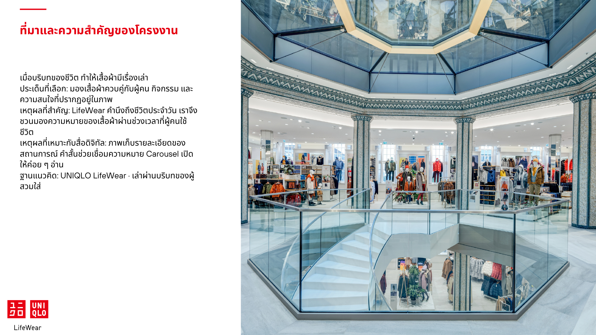

*ภาพที่ 1.1 ที่มาและเหตุผลเลือกแนวคิด LifeWear — ที่มา: STORYTELLING.pdf หน้า 13*

ตำแหน่งและวิธีวางภาพในรายงาน (ลบก่อนส่ง)

วางกึ่งกลางหลังย่อหน้าที่อธิบายเหตุผล ใช้เป็นภาพประกอบแนวคิด ไม่ใช้ภาพร้านเป็นหลักฐานสถานที่ผลิตของกลุ่ม ใช้ไฟล์ `slide-13.png` ที่เตรียมไว้ วางภาพกึ่งกลาง รักษาสัดส่วน และใส่คำบรรยายใต้ภาพ ความกว้างควรอยู่ในพื้นที่เนื้อหา ไม่เกินประมาณ 15 ซม. สำหรับ A4 ตามขอบเดิม

## 1.2 วัตถุประสงค์การสื่อสาร

| รหัส | วัตถุประสงค์การสื่อสาร | วิธีตรวจที่เสนอ |
|---|---|---|
| O1 เข้าใจ | ให้ผู้ชมอธิบาย LifeWear ผ่านความสัมพันธ์ระหว่างเสื้อผ้ากับชีวิตประจำวันได้ | ถามสารที่จำได้โดยไม่บอก Key Message ล่วงหน้า |
| O2 นำไปเชื่อมโยง | ให้ผู้ชมยกตัวอย่างการเลือกเสื้อผ้าที่สัมพันธ์กับกิจกรรมของตนเองได้ | ถามภาพที่เชื่อมกับชีวิตและแนวทางที่อาจนำไปปรับใช้ |
| O3 แลกเปลี่ยน | เปิดให้ผู้ชมเล่าการแต่งตัวและจังหวะชีวิตในแบบของตน | เก็บเรื่องเล่าหรือคำตอบหลังคำชวน พร้อมเหตุผลของการเลือก |

วัตถุประสงค์เรียบเรียงจากสไลด์หน้า 5 และ 14 โดยแยกความเข้าใจ การเชื่อมโยง และการแลกเปลี่ยนเป็นประเด็นที่ตรวจได้ “นำไปปรับใช้” ในร่างนี้ตรวจจากแนวทางที่ผู้ชมอธิบาย ยังไม่ถือเป็นหลักฐานว่าผู้ชมเปลี่ยนพฤติกรรมจริง วิธีประเมินอยู่ในหัวข้อ 5.4

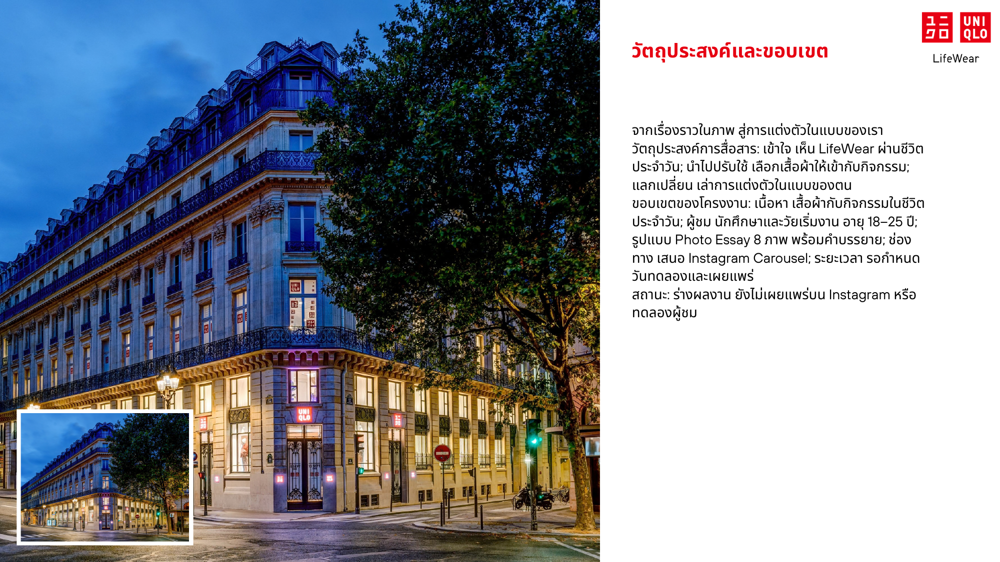

*ภาพที่ 1.2 วัตถุประสงค์และขอบเขตที่แสดงในเอกสารนำเสนอ — ที่มา: STORYTELLING.pdf หน้า 14*

ตำแหน่งและวิธีวางภาพในรายงาน (ลบก่อนส่ง)

วางหลังตาราง O1–O3 คงตารางรายงานเป็นข้อความแก้ไขได้ ภาพนี้แสดงการนำแนวคิดไปจัดหน้า ใช้ไฟล์ `slide-14.png` ที่เตรียมไว้ วางภาพกึ่งกลาง รักษาสัดส่วน และใส่คำบรรยายใต้ภาพ ความกว้างควรอยู่ในพื้นที่เนื้อหา ไม่เกินประมาณ 15 ซม. สำหรับ A4 ตามขอบเดิม

## 1.3 ขอบเขตของโครงงาน

| ด้าน | ขอบเขตของโครงงาน |
|---|---|
| เนื้อหา | เสื้อผ้าในบริบทกิจกรรม ความสนใจ ตัวตน และชีวิตประจำวัน |
| ผู้ชมหลัก | นักศึกษาและวัยเริ่มทำงาน อายุประมาณ 18–25 ปี ตามหน้า 5–6 และ 14–15 |
| ขอบเขตการทดลองที่เสนอ | อายุ 18–30 ปี ตามส่วนแผนทดลองหน้า 22 และ 25–28; รอทีมยืนยันช่วงอายุฉบับส่ง |
| ผลงาน | Photo Essay 8 ภาพ บทเปิด คำบรรยาย สารปิด Storyboard และทะเบียนภาพ |
| เอกสารนำเสนอ | STORYTELLING.pdf จำนวน 29 หน้า ซึ่งจัดวางแล้ว ใช้ประกอบการอธิบายและรายงาน |
| ช่องทางปัจจุบัน | GitHub Public สำหรับแชร์ฉบับร่างและชุดภาพ |
| ช่องทางที่เสนอ | Instagram Carousel 8 ภาพ; ยังไม่ได้เผยแพร่บน Instagram |
| ระยะเวลา | ร่างแรก 1 ตุลาคม 2569; ปรับรายงานจากสไลด์ 5 ตุลาคม 2569; [ระบุวันทดลองและส่งงาน] |

สไลด์มีช่วงอายุสองชุด รายงานจึงแยกผู้ชมหลักออกจากกรอบทดลองเพื่อแสดงความต่างตามต้นทาง การแยกนี้เป็นข้อเสนอในการเรียบเรียงร่าง ไม่ใช่หลักฐานว่ากลุ่มยืนยันขอบเขตสองระดับแล้ว ประเด็นที่ต้องยืนยันรวมไว้ในคู่มือท้ายรายงาน

## 1.4 ประโยชน์ที่คาดว่าจะได้รับ

ผู้ชมได้รับมุมมองในการพิจารณาเสื้อผ้าผ่านกิจกรรมของตนเอง และมีพื้นที่แลกเปลี่ยนประสบการณ์การแต่งตัว ผู้จัดทำได้ฝึกคัดภาพ วางโครงเรื่อง เขียนคำบรรยาย และจัดรูปแบบนำเสนอให้ภาพทำหน้าที่เล่าเรื่องร่วมกับภาษา

ผลต่อผู้ชมเป็นประโยชน์ที่คาดหวัง การประเมินในหัวข้อ 5.4 จะตรวจความเข้าใจ ความเชื่อมโยง และการแลกเปลี่ยนจากคำตอบจริง ส่วนสิ่งที่ผลิตสำเร็จแล้วรายงานในหัวข้อ 5.5

# บทที่ 2 การวิเคราะห์กลุ่มเป้าหมายและแนวคิดหลัก

## 2.1 กลุ่มเป้าหมายของโครงงาน

**สถานะข้อมูล: กลุ่มเป้าหมายที่กำหนดเพื่อออกแบบ ไม่ใช่ผลสำรวจผู้ชม**

| ประเด็น | รายละเอียดตามสไลด์ |
|---|---|
| กลุ่มหลัก | นักศึกษาและผู้เริ่มต้นทำงาน อายุประมาณ 18–25 ปี |
| ความสนใจที่ตั้งสมมติฐาน | แฟชั่นเรียบง่าย การแต่งตัวในชีวิตประจำวัน Lifestyle คาเฟ่ การเดินทาง และสื่อสังคม |
| ความต้องการที่ตั้งสมมติฐาน | เลือกเสื้อผ้าที่จัดการง่าย ใช้กับหลายกิจกรรม และสะท้อนสไตล์ตนเอง |
| บริบทรับชมที่ออกแบบ | ดูภาพและข้อความผ่านสมาร์ตโฟน โดยติดตามเรื่องตามลำดับ |
| เหตุผลเลือก | เป็นช่วงชีวิตที่มีบริบทการเรียน เริ่มทำงาน และกิจกรรมส่วนตัวหลากหลาย |
| กลุ่มสำหรับทดลองที่เสนอ | 18–30 ปีตามหน้า 25–28; ควรบันทึกและแยกช่วงอายุจริงเมื่อเก็บผล |

ข้อมูลอ้างหน้า 6 และ 15 คำว่า “ใส่ง่ายสบาย” ในสไลด์ตีความเป็นความต้องการที่สมมติไว้ ไม่ใช้ยืนยันคุณสมบัติของสินค้า เนื้อหาเกี่ยวกับผู้ชมต้องตรวจด้วยการทดลองก่อนนำไปสรุป

## 2.2 พฤติกรรมการใช้สื่อของกลุ่มเป้าหมาย

ตารางหน้า 15 ช่วยเปรียบเทียบช่องทางกับรูปแบบ Photo Essay รายงานใช้เป็นสมมติฐานการเลือกสื่อ ไม่ถือเป็นผลวิจัยพฤติกรรมผู้ใช้ของแต่ละแพลตฟอร์ม

| ช่องทาง | บริบทการอ่าน / เหตุผล | ข้อสรุปสำหรับโครงงาน |
|---|---|---|
| Instagram | รองรับภาพต่อเนื่องใน Feed / Carousel และข้อความสั้น | เสนอเป็นช่องทางหลักสำหรับฉบับ Carousel |
| TikTok | ส่วนที่นำมาเปรียบเทียบเน้นวิดีโอสั้น | ยังไม่ใช่ช่องทางหลักของผลงานภาพนิ่งชุดนี้ |
| Facebook | ใช้เผยแพร่ภาพและข้อความได้ | เป็นช่องทางรองที่อาจพัฒนาต่อ ยังไม่มีแผนโพสต์จริง |
| YouTube | ส่วนที่นำมาเปรียบเทียบเน้นงานวิดีโอ | ยังไม่ใช่ช่องทางหลักของรูปแบบปัจจุบัน |
| GitHub / Markdown | รวมผลงาน แหล่งภาพ และเอกสารที่ตรวจย้อนกลับได้ | ใช้แชร์ร่างที่เปิดอ่านได้แล้ว |

การเลือกช่องทางมาจากความสัมพันธ์ระหว่างรูปแบบเรื่องกับวิธีอ่าน ยังต้องตรวจความสะดวกของผู้ชมจริง และไม่สรุปว่าช่องทางใดใช้กับภาพนิ่งไม่ได้โดยทั่วไป

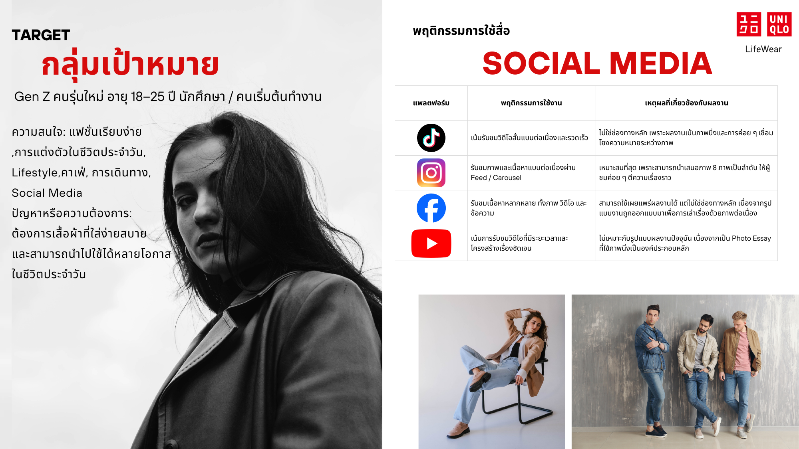

*ภาพที่ 2.1 กลุ่มเป้าหมายและการเปรียบเทียบช่องทางตามสมมติฐาน — ที่มา: STORYTELLING.pdf หน้า 15*

ตำแหน่งและวิธีวางภาพในรายงาน (ลบก่อนส่ง)

หากข้อความเล็ก ให้ใช้ด้านซ้ายกับด้านขวาเป็นภาพย่อย (ก)–(ข) หรือย้ายภาพเต็มไปภาคผนวก ตารางรายงานยังต้องอ่านได้โดยไม่พึ่งภาพ ใช้ไฟล์ `slide-15.png` ที่เตรียมไว้ วางภาพกึ่งกลาง รักษาสัดส่วน และใส่คำบรรยายใต้ภาพ ความกว้างควรอยู่ในพื้นที่เนื้อหา ไม่เกินประมาณ 15 ซม. สำหรับ A4 ตามขอบเดิม

## 2.3 Audience Insight

**Audience Insight — สมมติฐานที่กลุ่มใช้ในการออกแบบ**

คนรุ่นใหม่อาจต้องการเสื้อผ้าที่สัมพันธ์กับกิจวัตรและการแสดงตัวตน มากกว่าการแต่งตัวให้เหมือนผู้อื่นเพียงอย่างเดียว การเห็นกิจกรรมและบริบทในภาพจึงอาจทำให้ผู้ชมเชื่อมเรื่องเสื้อผ้ากับชีวิตของตนได้

แนวคิดเรียบเรียงจากหน้า 6 และ 16 ผลต่อการออกแบบคือเลือกภาพเดินในเมือง ถ่ายภาพ ทำงานสร้างสรรค์ อ่านหนังสือ และพัก แล้วใช้คำบรรยายสั้นเปิดให้ตีความร่วมกับประสบการณ์ส่วนตัว

ยังไม่มีข้อมูลสัมภาษณ์หรือสำรวจรองรับ Insight นี้ จึงต้องตรวจด้วยสารที่ผู้ชมจำได้ ภาพที่เกี่ยวข้อง และเหตุผลที่ให้หลังรับชม ภาพ Persona / Insight วางรวมในหัวข้อ 2.4

## 2.4 Persona ของกลุ่มเป้าหมาย

**Persona สมมติสำหรับการออกแบบ: โทมัส อายุ 22 ปี**

ใช้ชื่อและรายละเอียดจากหน้า 16 เพื่อให้รายงานตรงกับเอกสารนำเสนอ บุคคลนี้เป็นตัวแทนเชิงออกแบบ ไม่ใช่ผู้ให้ข้อมูลสัมภาษณ์ และภาพบุคคลประกอบสไลด์ไม่ใช้ยืนยันตัวตนของ Persona

| รายการ | รายละเอียด |
|---|---|
| ชื่อ / อายุ | โทมัส อายุ 22 ปี |
| บริบท | คนรุ่นใหม่ที่มีกิจกรรมและรูปแบบการใช้ชีวิตหลากหลาย |
| เป้าหมาย | ใช้ชีวิตและแสดงตัวตนในแบบของตน โดยเลือกสิ่งที่เหมาะกับกิจวัตร |
| ความกังวล | หลีกเลี่ยงเนื้อหาที่รู้สึกว่าเป็นการขายตรง และการแต่งตัวตามกระแสเพียงอย่างเดียว |
| พฤติกรรมสื่อที่สมมติ | ใช้สื่อสังคมผ่านสมาร์ตโฟน สนใจเนื้อหาที่เล่าด้วยภาพและอ่านต่อเนื่องได้ |
| สิ่งดึงดูด | ภาพที่มีบรรยากาศ กิจกรรม และบริบทที่เชื่อมกับตนเองได้ |
| ผลต่อการออกแบบ | ให้ภาพนำเรื่อง ใช้คำบรรยายสั้น และวางหลายกิจกรรมในชุดเดียว |
| สถานะการยืนยัน | ยังไม่ได้ตรวจสอบกับผู้ชมจริง |

Persona ในรายงานฉบับนี้แทน “เมย์” ของร่างก่อนหน้า โดยปรับเฉพาะรายงานตาม PDF ล่าสุด เอกสารร่างอื่นยังคงฉบับเดิมตามขอบเขตงานครั้งนี้

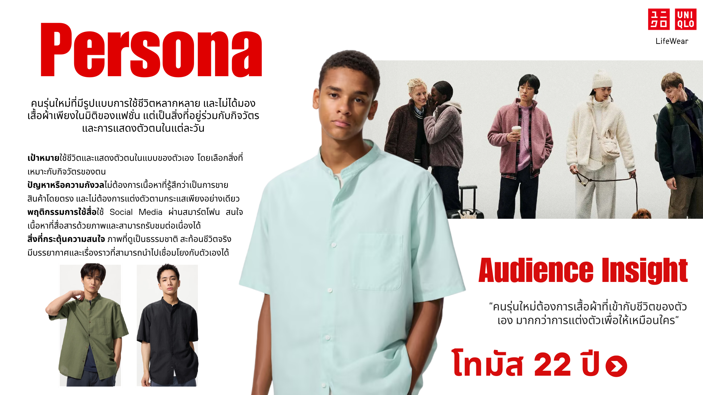

*ภาพที่ 2.2 Persona โทมัสและ Audience Insight สำหรับการออกแบบ — ที่มา: STORYTELLING.pdf หน้า 16*

ตำแหน่งและวิธีวางภาพในรายงาน (ลบก่อนส่ง)

วางหลังตาราง Persona หากต้องครอป เลือกข้อความ Persona และ Insight โดยคงป้ายชื่อกับอายุ ภาพบุคคลไม่ใช่หลักฐานผู้ให้ข้อมูลจริง ใช้ไฟล์ `slide-16.png` ที่เตรียมไว้ วางภาพกึ่งกลาง รักษาสัดส่วน และใส่คำบรรยายใต้ภาพ ความกว้างควรอยู่ในพื้นที่เนื้อหา ไม่เกินประมาณ 15 ซม. สำหรับ A4 ตามขอบเดิม

## 2.5 แนวคิดหลักของเรื่อง

**Big Idea: มองเสื้อผ้าผ่านกิจกรรมและจังหวะชีวิตของผู้สวมใส่**

“จังหวะชีวิตธรรมดา” เป็นแกนสร้างสรรค์ที่รวมภาพหลายคนและหลายเมือง ภาพเคลื่อนไหวสลับกับภาพลงมือทำ นั่งอ่าน และพัก ทำให้เรื่องเปลี่ยนจังหวะผ่านสถานการณ์ที่มองเห็น

แนวคิดนี้ปรากฏในลำดับ P01–P08 และคำบรรยายที่เชื่อมกิจกรรมกับการเลือกของแต่ละคน โดยอ้างความสัมพันธ์กับปรัชญา LifeWear จากแหล่งทางการ

## 2.6 สารหลักของเรื่อง

**Key Message: “เสื้อผ้าที่เรียบง่ายเป็นส่วนหนึ่งของชีวิตในแบบที่เราเลือก”**

สารหลักเชื่อมความเรียบง่ายกับการใช้ชีวิตและการเลือก P02 และ P05 เน้นสไตล์ของบุคคล P03–P06 เน้นกิจกรรมและพื้นที่ส่วนตัว ส่วน P07–P08 กลับสู่ผู้คนและปิดธีมร่วมกัน

ประโยคนี้จัดทำสำหรับโครงงาน เป็นสารที่ใช้ตรวจความเข้าใจของผู้ชมตาม O1 และใช้สม่ำเสมอใน Photo Essay, Report และ Slides

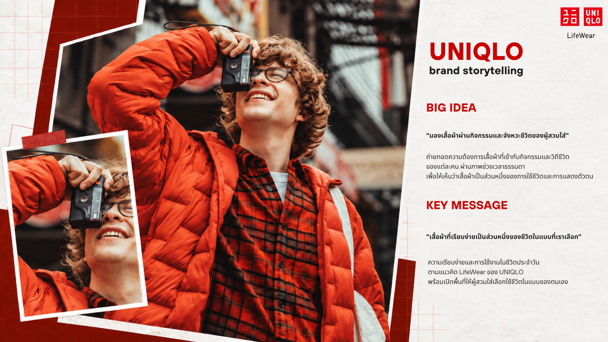

*ภาพที่ 2.3 Big Idea และ Key Message ของโครงงาน — ที่มา: STORYTELLING.pdf หน้า 17*

ตำแหน่งและวิธีวางภาพในรายงาน (ลบก่อนส่ง)

วางหลังเหตุผลเลือกสารหลัก หากครอปให้เก็บทั้ง Big Idea และ Key Message พร้อมหัวข้อ ใช้ไฟล์ `slide-17.png` ที่เตรียมไว้ วางภาพกึ่งกลาง รักษาสัดส่วน และใส่คำบรรยายใต้ภาพ ความกว้างควรอยู่ในพื้นที่เนื้อหา ไม่เกินประมาณ 15 ซม. สำหรับ A4 ตามขอบเดิม

# บทที่ 3 การออกแบบเรื่องเล่า

## 3.1 ประเภทของการเล่าเรื่องที่ใช้

ใช้ **Brand Storytelling** เป็นประเภทหลัก โดยนำแนวคิด LifeWear มาเล่าผ่านบริบทของผู้คน และนำเสนอด้วย **Photo Essay / Visual Storytelling** ซึ่งให้ภาพสร้างสถานการณ์และให้คำบรรยายเชื่อมธีม

การคัดสรรภาพทางการช่วยให้ศึกษาการตีความและจัดลำดับได้โดยตรง งานที่ผลิตจึงอยู่ที่วิธีเลือกภาพ ลำดับ และภาษา ภายใต้กรอบโครงงานเพื่อการศึกษา

## 3.2 โครงสร้างเรื่องเล่า

โครงสร้างหลักเป็น **Beginning–Middle–End เชิงธีม** และอธิบายหน้าที่รายช่วงตามหน้า 18–19 ดังนี้

| หน้าที่ในเรื่อง | ภาพ | ความหมายและเหตุผล |
|---|---|---|
| Opening | P01 | เปิดด้วยคนและเมือง ชวนสังเกตเสื้อผ้าในช่วงเวลาธรรมดา |
| Conflict / โจทย์เรื่อง | P02 | ตั้งคำถามว่าเสื้อผ้าที่เลือกสัมพันธ์กับความสนใจและวิถีชีวิตอย่างไร |
| Development | P03–P05 | ขยายกิจกรรม พื้นที่ และสไตล์ของบุคคลที่ต่างกัน |
| Climax / จุดเปลี่ยนจังหวะ | P06 | เปลี่ยนสู่ช่วงพักและความสงบ เป็นจุดเน้นทางความหมาย ไม่ใช่เหตุการณ์พีคแบบละคร |
| Resolution | P07–P08 | กลับสู่การใช้ชีวิตร่วมกัน แล้วเชื่อมสาร “เสื้อผ้าที่เรียบง่ายเป็นส่วนหนึ่งของชีวิตในแบบที่เราเลือก” |
| CTA | หลัง P08 / คำชวนท้ายหน้า 19 | ชวนผู้ชมเล่าจังหวะชีวิตและเหตุผลที่เลือกแต่งตัวในแบบของตน |

เมื่อนำมารวมเป็นสามช่วงจะได้ เปิด P01–P02 ขยาย P03–P06 และปิด P07–P08 ชื่อ Climax ในสไลด์จึงใช้เรียกจุดเปลี่ยนจังหวะของชุด โดยไม่สร้างเหตุการณ์หรือแรงจูงใจเพิ่มให้คนในภาพ

คำชวนในหน้า 19 เสนอให้แชร์ภาพในชุด UNIQLO พร้อมเล่ากิจกรรม เป็น CTA สำหรับแผนสื่อสังคม ยังไม่มีการจัดแคมเปญหรือเก็บภาพตอบกลับจริง ส่วนคำชวนใน Photo Essay เปิดให้ผู้อ่านคิดถึงกิจกรรมของตน

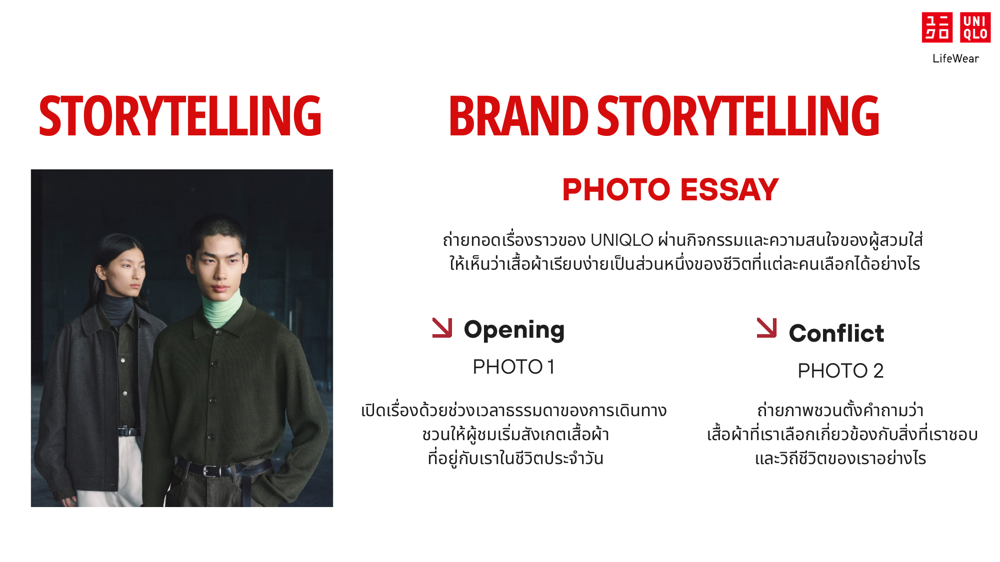

*ภาพที่ 3.1 Opening และ Conflict ในการออกแบบลำดับภาพ — ที่มา: STORYTELLING.pdf หน้า 18*

ตำแหน่งและวิธีวางภาพในรายงาน (ลบก่อนส่ง)

ใช้หน้า 18–19 ต่อเนื่องกันหรือเป็นภาพย่อยสองภาพ ห้ามใช้ภาพแฟชั่นประกอบหน้า 18 แทนภาพ P01–P02 ของผลงาน ใช้ไฟล์ `slide-18.png` ที่เตรียมไว้ วางภาพกึ่งกลาง รักษาสัดส่วน และใส่คำบรรยายใต้ภาพ ความกว้างควรอยู่ในพื้นที่เนื้อหา ไม่เกินประมาณ 15 ซม. สำหรับ A4 ตามขอบเดิม

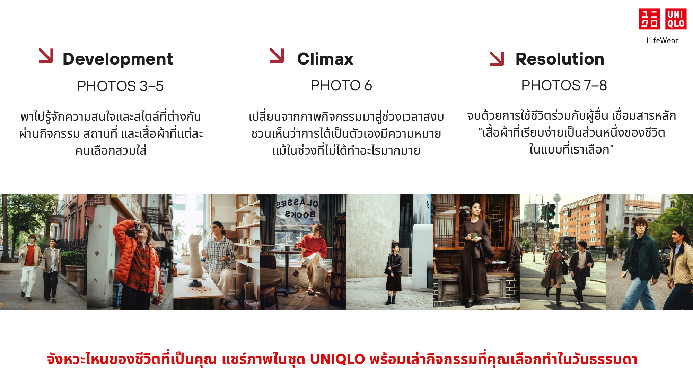

*ภาพที่ 3.2 Development จุดเปลี่ยนจังหวะ Resolution และ CTA — ที่มา: STORYTELLING.pdf หน้า 19*

ตำแหน่งและวิธีวางภาพในรายงาน (ลบก่อนส่ง)

คงข้อความบทบาทของภาพและ CTA ด้านล่าง อ่านร่วมกับตาราง 3.2 ที่อธิบาย Climax เชิงธีม ใช้ไฟล์ `slide-19.png` ที่เตรียมไว้ วางภาพกึ่งกลาง รักษาสัดส่วน และใส่คำบรรยายใต้ภาพ ความกว้างควรอยู่ในพื้นที่เนื้อหา ไม่เกินประมาณ 15 ซม. สำหรับ A4 ตามขอบเดิม

## 3.3 ตัวละครหรือผู้เล่าเรื่อง

ผู้คนหลายคนในภาพทำหน้าที่เป็นองค์ประกอบของเรื่อง ผู้เล่าเชื่อมภาพด้วยข้อความภาษาไทยเชิงธีม โดยใช้เฉพาะสถานการณ์ที่มองเห็นและบริบทที่แหล่งทางการระบุ

| องค์ประกอบ | วิธีใช้ |
|---|---|
| บทบาทของบุคคล | แสดงกิจกรรม สไตล์ และบริบทที่เสื้อผ้าปรากฏ |
| เป้าหมาย / แรงจูงใจ | ไม่กำหนดเพิ่มเติมให้บุคคลในภาพ |
| ปัญหาหรือข้อจำกัด | ใช้โจทย์เชิงแนวคิดในหัวข้อ 3.4 |
| ความเปลี่ยนแปลง | เกิดจากลำดับมุมมอง เมือง กิจกรรม และความสัมพันธ์ระหว่างคน |
| ความเชื่อมโยงกับผู้ชม | เปิดให้ผู้ชมยกตัวอย่างจากประสบการณ์ตนเองตาม O2 |

คำบรรยายจึงเป็นเสียงของโครงงาน ไม่ใช่คำสัมภาษณ์หรือบันทึกความคิดของบุคคลในภาพ

## 3.4 ความขัดแย้งหรือปัญหาหลัก

โจทย์ขับเคลื่อนเรื่องคือ **เสื้อผ้าที่เรียบง่ายเชื่อมกับกิจกรรมและตัวตนที่ต่างกันได้อย่างไร** ความขัดแย้งในงานนี้อยู่ที่คำถามเชิงแนวคิด จึงไม่กำหนดเหตุการณ์ปะทะหรืออุปสรรคส่วนบุคคลเพิ่มจากภาพ

ลำดับเรื่องตอบโจทย์ผ่านสถานการณ์หลายแบบ และคำบรรยายที่ชวนพิจารณาการเลือกกับสิ่งที่ทำ ความชัดเจนของธีมจะตรวจจากสารที่ผู้ชมจำได้และช่วงภาพที่เชื่อมโยงกับตนเอง

## 3.5 อารมณ์และบรรยากาศของเรื่อง

| ช่วงภาพ | อารมณ์ที่ออกแบบ | องค์ประกอบภาพและภาษา |
|---|---|---|
| P01–P02 | เคลื่อนไหว มีเอกลักษณ์ | คนเดินบนถนนและแจ็กเก็ตสีส้ม เชื่อมจังหวะเมืองกับการเลือก |
| P03–P04 | ตั้งใจ แล้วผ่อนจังหวะ | สลับพื้นที่ลงมือทำกับภาพนั่งอ่านหนังสือ |
| P05–P06 | สงบ มีพื้นที่ส่วนตัว | สถาปัตยกรรมและคาเฟ่ ใช้ข้อความสั้นที่อ่านได้โดยไม่เร่ง |
| P07–P08 | มีชีวิตชีวา เป็นกันเอง | คู่คนที่ทางข้ามและฉากเมือง กลับสู่ความสัมพันธ์กับผู้อื่น |

อารมณ์เกิดจากภาพต้นฉบับ การเรียงลำดับ และภาษา ภาพไม่ผ่านการเพิ่มฟิลเตอร์หรือแก้ฉาก และรูปแบบนี้ไม่ใช้เสียงหรือเพลง

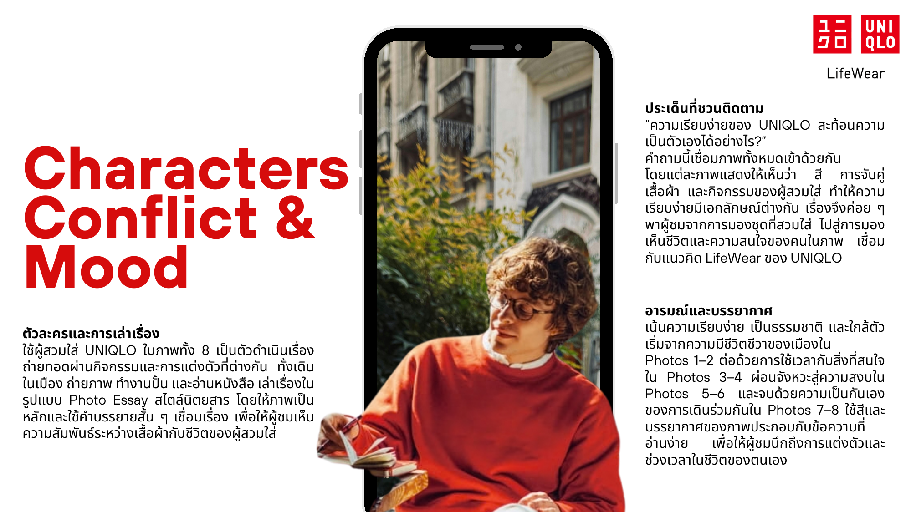

*ภาพที่ 3.3 ผู้คน โจทย์เรื่อง และอารมณ์ของชุดภาพ — ที่มา: STORYTELLING.pdf หน้า 21*

ตำแหน่งและวิธีวางภาพในรายงาน (ลบก่อนส่ง)

วางหลังตารางอารมณ์ หากข้อความเล็กให้แบ่งข้อความสามส่วนเป็นภาพย่อย และคงภาพเต็มไว้ในโฟลเดอร์ ใช้ไฟล์ `slide-21.png` ที่เตรียมไว้ วางภาพกึ่งกลาง รักษาสัดส่วน และใส่คำบรรยายใต้ภาพ ความกว้างควรอยู่ในพื้นที่เนื้อหา ไม่เกินประมาณ 15 ซม. สำหรับ A4 ตามขอบเดิม

## 3.6 Storyboard / Script / Content Plan

Storyboard ประกอบด้วย 8 ช่วง คำบรรยายด้านล่างตรงกับข้อความในผลงาน และใช้รหัส P01–P08 เชื่อมกับทะเบียนภาพ

| ภาพ | เนื้อหา | คำบรรยาย | หน้าที่ |
|---|---|---|---|
| P01 | คู่คนเดินบนถนนในนิวยอร์ก | เมืองมีจังหวะของมัน และเรามีจังหวะของตัวเอง | เปิดบริบทชีวิตในเมือง |
| P02 | ชายสวมแจ็กเก็ตสีส้มและถือกล้อง | สีที่เราเลือก เติมรายละเอียดของเราให้วันธรรมดา | เชื่อมการแต่งตัวกับการเลือก |
| P03 | หญิงทำงานในสตูดิโอเซรามิก | เมื่อเราให้เวลากับสิ่งที่ทำ เสื้อผ้าก็อยู่ในเรื่องราวนั้น | ขยายเรื่องสู่กิจกรรมสร้างสรรค์ |
| P04 | ชายนั่งกับหนังสือในร้าน Molasses Books | ระหว่างภารกิจของวัน เรายังเว้นที่ไว้ให้สิ่งที่ชอบ | ผ่อนจังหวะสู่ความสนใจส่วนตัว |
| P05 | หญิงยืนท่ามกลางสถาปัตยกรรมในโซล | แต่ละเมืองมีเอกลักษณ์ เช่นเดียวกับสไตล์ของแต่ละคน | ขยายธีมข้ามคนและสถานที่ |
| P06 | หญิงถือถ้วยในพื้นที่คาเฟ่ | บางจังหวะของชีวิต เริ่มจากการหยุดพัก | เว้นช่วงพักก่อนเข้าสู่บทปิด |
| P07 | คู่คนเคลื่อนผ่านทางข้ามในเบอร์ลิน | บนเส้นทางเดียวกัน เรายังมีสไตล์ในแบบของตัวเอง | เชื่อมพื้นที่ส่วนตัวกับผู้อื่น |
| P08 | คู่คนในฉากเมืองนิวยอร์ก | วันธรรมดามีเรื่องราว และเสื้อผ้าอยู่ในเรื่องราวนั้น | ปิดเรื่องและย้ำสารหลัก |

ฉบับฝังภาพครบทุกช่องอยู่ใน [Photo Essay](Uniqlo_LifeWear_PhotoEssay.md) ส่วน Storyboard และภาคผนวก ข Storyboard นี้เป็นแผนลำดับภาพนิ่ง ไม่กำหนดจำนวนช็อตหรือความยาววิดีโอ

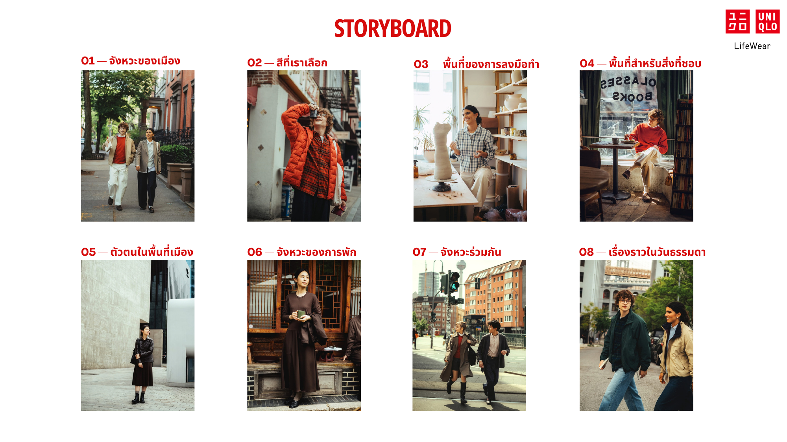

*ภาพที่ 3.4 Storyboard 8 ภาพตามลำดับ P01–P08 — ที่มา: STORYTELLING.pdf หน้า 20*

ตำแหน่งและวิธีวางภาพในรายงาน (ลบก่อนส่ง)

ใช้เต็มหน้าแนวนอนเมื่อส่งออก หรือวางกว้างประมาณพื้นที่เนื้อหา A4 โดยตรวจชื่อช่วง หากเล็กเกินอ่านให้ใช้สองแถวเป็นภาพย่อย ใช้ไฟล์ `slide-20.png` ที่เตรียมไว้ วางภาพกึ่งกลาง รักษาสัดส่วน และใส่คำบรรยายใต้ภาพ ความกว้างควรอยู่ในพื้นที่เนื้อหา ไม่เกินประมาณ 15 ซม. สำหรับ A4 ตามขอบเดิม

# บทที่ 4 กระบวนการผลิตผลงาน

## 4.1 รูปแบบสื่อที่เลือกใช้

Photo Essay / Visual Storytelling ให้ภาพบริบททำหน้าที่นำเรื่อง และให้ข้อความสั้นกำหนดธีมร่วม เหมาะกับงานคัดสรรที่มีภาพต่างสถานที่ เพราะสามารถเล่าด้วยความสัมพันธ์ของแนวคิดแทนลำดับเหตุการณ์

องค์ประกอบที่จัดทำคือบทเปิด ลำดับ 8 ภาพ คำบรรยาย สารปิด Storyboard และทะเบียนภาพ ภาพถ่ายคงงานต้นฉบับของผู้สร้าง พร้อมระบุเครดิตแยกจากงานเขียน

## 4.2 เหตุผลในการเลือกแพลตฟอร์ม

| ช่องทาง | เหตุผลเลือก | สถานะ / สิ่งที่ต้องตรวจ |
|---|---|---|
| Markdown บน GitHub | รวมผลงาน Storyboard และแหล่งภาพไว้ในเอกสารที่อ่านและแก้ไขได้ | [เผยแพร่ร่างใน Public repository](https://github.com/uhactuallyidk/uniqlo-lifewear-photo-essay) แล้ว; ใช้พาธภาพสัมพัทธ์ใน repository |
| Instagram Carousel | เสนอให้หนึ่งภาพเป็นหนึ่งช่วง ผู้ชมควบคุมจังหวะเลื่อนได้ | ยังไม่ได้จัดหน้าและเผยแพร่ ต้องตรวจรูปแบบการอ่านและเงื่อนไขใช้ภาพ |

การเลือก Instagram พิจารณาจากรูปแบบภาพต่อเนื่อง ยังไม่มีข้อมูลพฤติกรรมผู้ชมรองรับ ส่วน repository เป็นช่องทางแชร์ฉบับร่างพร้อมภาพและเอกสารประกอบ

## 4.3 ขั้นตอนการผลิตผลงาน

กระบวนการเรียบเรียงตามหน้า 22 และไฟล์ที่ตรวจได้จริง แยกสิ่งส่งมอบที่มีแล้วออกจากขั้นตอนที่ยังรอ

| ขั้นตอน | การดำเนินงาน | หลักฐาน / สถานะ |
|---|---|---|
| เลือกประเด็น | ใช้ UNIQLO LifeWear และธีมจังหวะชีวิตธรรมดา | แนวคิดในหน้า 17 และ Concept Note |
| วิเคราะห์ผู้ชม | กำหนดผู้ชม Insight และ Persona | หน้า 15–16; ยังเป็นสมมติฐาน |
| วางโครงเรื่อง | เชื่อมภาพหลายเมืองด้วยช่วงเปิด ขยาย และปิด | หน้า 18–19 |
| เขียนบท / Storyboard | เรียงภาพ 8 ภาพและเขียนคำบรรยาย | หน้า 20 และ Photo Essay |
| จัดเตรียมสื่อ | ดาวน์โหลดภาพต้นฉบับ เก็บชื่อไฟล์และที่มา | ภาพ P01–P08 และทะเบียนภาพ |
| ออกแบบและเรียบเรียง | จัด Markdown และเอกสารนำเสนอ PDF | MD ที่มีเดิม และ STORYTELLING.pdf 29 หน้า |
| ตรวจและปรับ | ตรวจภาษา ความสัมพันธ์ของภาพ แหล่งที่มา และการเปิดไฟล์ | ฉบับรายงานที่ปรับตาม PDF วันที่ 5 ตุลาคม 2569 |
| เตรียมนำเสนอ | มี PDF พร้อมใช้ประกอบการนำเสนอ | ยังไม่มีบันทึกวันนำเสนอหรือเวลาซ้อมจริง |
| พัฒนาต่อ | ทดลองกับผู้ชมและจัด Instagram Carousel | ยังไม่ได้ดำเนินการ |

ภาพสไลด์แสดงวิธีอธิบายกระบวนการ หลักฐานการประชุมหรือการปฏิบัติงานของสมาชิกจะเพิ่มเติมในภาคผนวก ค ไม่ใช้ภาพร้านหรือบุคคลประกอบสไลด์แทนหลักฐานเหล่านั้น

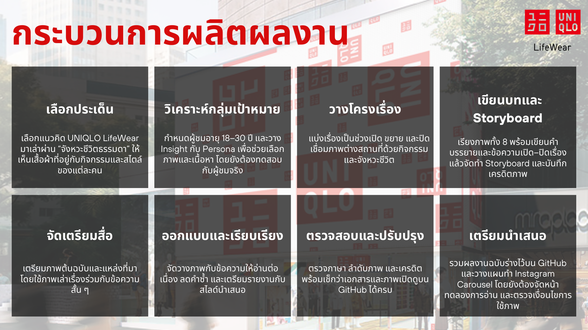

*ภาพที่ 4.1 กระบวนการจัดทำที่แสดงในสไลด์ — ที่มา: STORYTELLING.pdf หน้า 22*

ตำแหน่งและวิธีวางภาพในรายงาน (ลบก่อนส่ง)

วางหลังตารางขั้นตอน เป็นภาพอธิบายกระบวนการ ไม่ใช่หลักฐานว่าประชุมหรือทดลองผู้ชมแล้ว ใช้ไฟล์ `slide-22.png` ที่เตรียมไว้ วางภาพกึ่งกลาง รักษาสัดส่วน และใส่คำบรรยายใต้ภาพ ความกว้างควรอยู่ในพื้นที่เนื้อหา ไม่เกินประมาณ 15 ซม. สำหรับ A4 ตามขอบเดิม

## 4.4 เครื่องมือที่ใช้ในการผลิต

| เครื่องมือ | งานที่ใช้ / แหล่งข้อมูล |
|---|---|
| Codex / เครื่องมือค้นเว็บ | ช่วยค้นแหล่งทางการ วางโครงเรื่อง ร่าง และทบทวนเนื้อหา |
| Python / urllib / Pillow | ดาวน์โหลดและตรวจไฟล์ภาพต้นฉบับ |
| Markdown / Codex editor | จัดทำ Photo Essay และร่างเอกสาร |
| Git / GitHub | บันทึกฉบับงานและแชร์ไฟล์พร้อมภาพ |
| Node.js / marked / Playwright | ตรวจพรีวิว Markdown ภาพ และตาราง |
| pypdf / Poppler | อ่านองค์ประกอบ PDF และแปลงสไลด์เป็นภาพสำหรับรายงานในรอบวันที่ 5 ตุลาคม 2569 |
| โปรแกรมที่ใช้จัด STORYTELLING.pdf | [ระบุโปรแกรมที่สมาชิกใช้จริง]; ยังไม่อนุมานจากหน้าตาสไลด์ |

รายการเดิมอ้างหน้า 23 และเพิ่มเครื่องมือที่ใช้จัดเตรียมรายงานรอบนี้ ภาพเครื่องมือและบทบาทวางรวมในหัวข้อ 4.5 ขอบเขต AI อธิบายในหัวข้อ 6.4

## 4.5 บทบาทและหน้าที่ของสมาชิกกลุ่ม

ชื่อและรหัสใช้ข้อมูลที่ผู้จัดทำให้ล่าสุด ส่วนบทบาทอ้างหน้า 23 การระบุบทบาทในสไลด์แสดงการแบ่งความรับผิดชอบ แต่ยังต้องเชื่อมกับสิ่งส่งมอบหรือบันทึกแก้ไขจริงของแต่ละคน

| สมาชิก / รหัสนักศึกษา | หน้าที่ตามหน้า 23 | งานที่รับผิดชอบ | หลักฐานที่ต้องยืนยันก่อนส่ง |
|---|---|---|---|
| พนัสชัย แก้วสอนดี 673210269-9 | บทและคำบรรยาย / เตรียมนำเสนอ | เรียบเรียงบทบรรยาย คำบรรยายภาพ และเนื้อหาสำหรับนำเสนอ | [ระบุไฟล์หรือการแก้ไขที่ทำจริง] |
| จักรพันธ์ อะวิสัย 673210575-2 | แหล่งภาพ / เครดิต | ค้นและจัดเตรียมภาพ ตรวจแหล่งที่มาและเครดิต | [ระบุไฟล์หรือการแก้ไขที่ทำจริง] |
| ปราณปริยา เวชกามา 673210585-9 | ออกแบบ / จัดหน้า | ออกแบบเลย์เอาต์และจัดหน้าสไลด์ | [ระบุไฟล์หรือการแก้ไขที่ทำจริง] |
| ปรมัตถ์ ทัศณรงค์ 673210844-1 | Storyboard / โครงเรื่อง | วางลำดับภาพและโครงเรื่องของ Photo Essay | [ระบุไฟล์หรือการแก้ไขที่ทำจริง] |
| ปุรัสกร อ้วนพรมมา 673210268-1 | Repository / เตรียมนำเสนอ | จัดเก็บไฟล์ใน GitHub และเตรียมชุดไฟล์สำหรับนำเสนอ | [ระบุไฟล์หรือการแก้ไขที่ทำจริง] |
| ณดล วิทักษบุตร 673210836-0 | ตรวจเนื้อหา | ตรวจความถูกต้องของข้อมูลและเนื้อหา | [ระบุไฟล์หรือการแก้ไขที่ทำจริง] |

หน้า 23 สะกดนามสกุลปุรัสกรต่างจากข้อมูลล่าสุด รายงานใช้ “ปุรัสกร อ้วนพรมมา” ตามผู้จัดทำ และคง PDF ที่ได้รับไว้โดยไม่แก้ต้นฉบับ

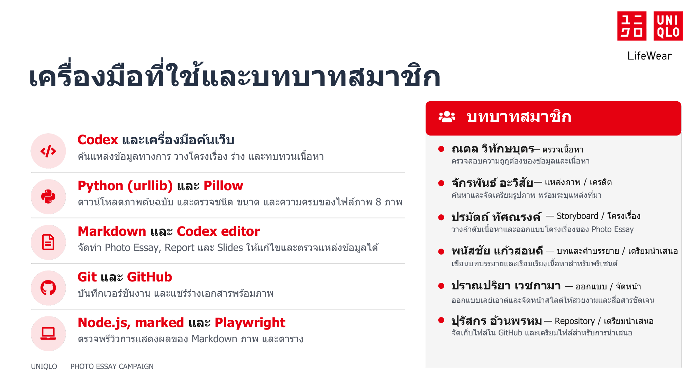

*ภาพที่ 4.2 เครื่องมือและการแบ่งบทบาทตามเอกสารนำเสนอ — ที่มา: STORYTELLING.pdf หน้า 23*

ตำแหน่งและวิธีวางภาพในรายงาน (ลบก่อนส่ง)

รายงานใช้ตารางชื่อที่แก้ตามข้อมูลล่าสุด ภาพสไลด์คงต้นฉบับ หากข้อความเล็กให้แยกส่วนเครื่องมือและสมาชิก ใช้ไฟล์ `slide-23.png` ที่เตรียมไว้ วางภาพกึ่งกลาง รักษาสัดส่วน และใส่คำบรรยายใต้ภาพ ความกว้างควรอยู่ในพื้นที่เนื้อหา ไม่เกินประมาณ 15 ซม. สำหรับ A4 ตามขอบเดิม

## 4.6 ปัญหา อุปสรรค และแนวทางแก้ไข

| ประเด็น | วิธีจัดการในรายงาน | สิ่งที่ยังต้องทำ |
|---|---|---|
| ภาพหลายเมือง | ใช้เรื่องเชิงธีมและคงบริบทจริง | ตรวจว่าคำบรรยายไม่ทำให้เข้าใจเป็นวันเดียวกัน |
| ช่วงอายุในสไลด์ต่างกัน | แยกผู้ชมหลัก 18–25 ปีจากกรอบทดลอง 18–30 ปี โดยระบุว่าเป็นข้อเสนอการเรียบเรียง | ให้ทีมยืนยันช่วงอายุฉบับส่ง |
| Persona ในร่างเก่าต่างจาก PDF | ใช้โทมัส อายุ 22 ปีตามหน้า 16 ในรายงาน | เมื่อต้องรวมเอกสารส่ง ควรยืนยันให้เป็น Persona เดียวกัน |
| ชื่อสมาชิกในหน้า 23 ต่างจากข้อมูลล่าสุด | ใช้ข้อมูลชื่อและรหัสที่ผู้จัดทำให้ล่าสุด | ตรวจชื่อในเอกสารส่งจริง |
| หลักฐานผู้ชมและกระบวนการยังไม่ครบ | แยกภาพออกแบบออกจากหลักฐานการทำงานและผลผู้ชม | เพิ่มข้อมูลจริงในภาคผนวก ค–ง |
| ภาพประกอบใน PDF มีมากกว่าชุดผลงาน | เก็บไฟล์และหน้าที่พบใน manifest โดยไม่รวมทุกภาพเป็นผลงาน 8 ภาพ | เติมแหล่งและสิทธิ์ของภาพประกอบที่ยังไม่ทราบ |
| การย้ายเครื่อง | แยกฉบับพาธเต็มในเครื่องกับฉบับพาธสัมพัทธ์บน GitHub | ส่งโฟลเดอร์ assets ร่วมกับไฟล์ MD |

# บทที่ 5 ผลงาน แผนเผยแพร่ และการวัดผล

## 5.1 รายละเอียดผลงาน Digital Storytelling

| รายการ | รายละเอียด |
|---|---|
| ชื่อผลงาน | UNIQLO LifeWear — เสื้อผ้าในจังหวะชีวิตธรรมดา |
| รูปแบบ / จำนวน | Photo Essay / Visual Storytelling 8 ภาพ พร้อมบทเปิด คำบรรยาย และสารปิด |
| กลุ่มหลักใน PDF | นักศึกษาและวัยเริ่มงาน อายุประมาณ 18–25 ปี; ข้อเสนอกรอบทดลอง 18–30 ปีดู 1.3 |
| Key Message | เสื้อผ้าที่เรียบง่ายเป็นส่วนหนึ่งของชีวิตในแบบที่เราเลือก |
| CTA | ชวนเล่าจังหวะชีวิตและการแต่งตัวในแบบของตน |
| ผลงานที่อ่านได้ | [Photo Essay และ Storyboard](Uniqlo_LifeWear_PhotoEssay.md) |
| เอกสารนำเสนอ | [STORYTELLING.pdf](STORYTELLING.pdf) จำนวน 29 หน้า |
| ชุดภาพสำหรับรายงาน | ภาพเต็มสไลด์ 29 หน้า ภาพ raster ที่สกัดได้ 104 ไฟล์ไม่ซ้ำ และต้นฉบับ Photo Essay 8 ภาพ |
| ช่องทางปัจจุบัน | GitHub Public สำหรับแชร์ร่าง |
| สถานะ Instagram / ผู้ชม | ยังไม่ได้โพสต์ Carousel หรือทดลองผู้ชม |

หน้า 2 และ 20 แสดงภาพชุด P01–P08 ชัดเจน จึงใช้เป็นภาพรวมผลงานและ Storyboard ส่วนภาพร้าน นางแบบ และภาพแฟชั่นอื่นใน PDF เป็นภาพประกอบการนำเสนอ ไม่เพิ่มจำนวนผลงานจาก 8 ภาพ

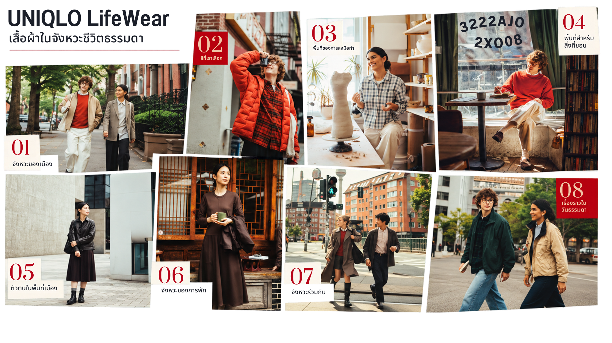

*ภาพที่ 5.1 ภาพรวม Photo Essay 8 ภาพ — ที่มา: STORYTELLING.pdf หน้า 2*

ตำแหน่งและวิธีวางภาพในรายงาน (ลบก่อนส่ง)

ใช้หน้า 2 หรือหน้า 20 เพื่อแสดงชิ้นงาน 8 ภาพ ไม่ใช้ภาพแฟชั่นอื่นในหน้า 24 แทนผลงาน ใช้ไฟล์ `slide-02.png` ที่เตรียมไว้ วางภาพกึ่งกลาง รักษาสัดส่วน และใส่คำบรรยายใต้ภาพ ความกว้างควรอยู่ในพื้นที่เนื้อหา ไม่เกินประมาณ 15 ซม. สำหรับ A4 ตามขอบเดิม

*ภาพที่ 5.2 ตัวอย่างภาพผลงาน P03 — ภาพ: UNIQLO LifeWear magazine / Kohei Kawashima; คำบรรยาย: “เมื่อเราให้เวลากับสิ่งที่ทำ เสื้อผ้าก็อยู่ในเรื่องราวนั้น”*

## 5.2 Link หรือ QR Code ผลงาน

- [Photo Essay และ Storyboard](https://github.com/uhactuallyidk/uniqlo-lifewear-photo-essay/blob/main/Uniqlo_LifeWear_PhotoEssay.md)
- [STORYTELLING.pdf](https://github.com/uhactuallyidk/uniqlo-lifewear-photo-essay/blob/main/STORYTELLING.pdf)
- [Repository พร้อมเอกสารและภาพ](https://github.com/uhactuallyidk/uniqlo-lifewear-photo-essay)

**QR Code:** ยังไม่ได้สร้าง สามารถสร้างจาก URL Photo Essay เมื่อจัดรายงานฉบับส่ง แล้วทดสอบด้วยสิทธิ์ผู้ชม

หน้า 24 มีข้อความ “CLICK HERE TO SEE ONLINE” แต่ไม่พบ link annotation ใน PDF ที่ได้รับ จึงใช้ URL จริงด้านบนเป็นทางเข้าผลงาน ภาพหน้าจอด้านล่างแสดงการเปิด Photo Essay ออนไลน์ที่ตรวจได้จริง วันที่ 5 ตุลาคม 2569

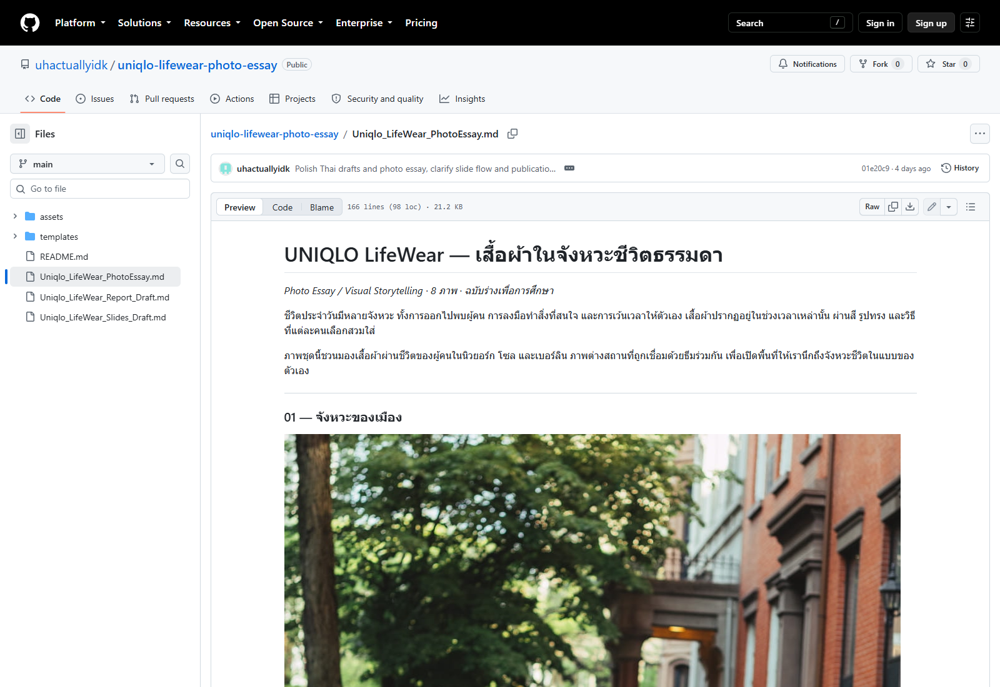

*ภาพที่ 5.3 หน้า Photo Essay ที่เปิดอ่านได้จริงบน GitHub จับภาพวันที่ 5 ตุลาคม 2569 เป็นหลักฐานการเข้าถึง ไม่ใช่ผลตอบรับผู้ชม*

> **การวางภาพ:** วางหลังรายการ URL โดยคงชื่อ repository และชื่อเอกสารให้เห็น ไม่ต้องสร้าง QR จำลอง

## 5.3 แผนการเผยแพร่ผลงาน

ตารางเรียบเรียงจากหน้า 25 โดยแยกการแชร์ที่เกิดขึ้นแล้วออกจากแผนเผยแพร่และแผนเก็บผล

| ช่วงเวลา | ช่องทาง | รูปแบบ | เป้าหมาย / สถานะ |
|---|---|---|---|
| 1 ตุลาคม 2569 | GitHub Public | Photo Essay, Storyboard, ภาพ และเอกสาร | แชร์ฉบับร่างแล้ว |
| 5 ตุลาคม 2569 | GitHub Public | รายงานที่ปรับตามสไลด์ พร้อม PDF และโฟลเดอร์ภาพรายงาน | อัปเดตชุดเอกสารรอบนี้ |
| หลังตรวจงานและเงื่อนไขภาพ; [วัน / เวลา] | Instagram | Carousel 8 ภาพ P01–P08 | แผนเผยแพร่ ยังไม่ได้โพสต์ |
| หลังจัดฉบับสำหรับทดลอง; [วัน / เวลา] | แบบสอบถาม / สัมภาษณ์ | ผู้ชมอ่านครบชุดก่อนตอบ | ตรวจความเข้าใจ ความต่อเนื่อง และความเชื่อมโยง; ยังไม่ได้ทดลอง |
| หลังเก็บผลจริง | รายงานผล / Instagram Insights หากมีโพสต์ | สรุปคำตอบและปฏิสัมพันธ์ | ประเมินและปรับงานจากหลักฐาน |

**Caption ที่เสนอ:** “เสื้อผ้าที่เรียบง่ายเป็นส่วนหนึ่งของชีวิตในแบบที่เราเลือก” พร้อมชื่อโครงงาน เครดิตภาพ และข้อความระบุโครงงานเพื่อการศึกษา

**Hashtag ตามหน้า 25:** #UNIQLO #LifeWear #VisualStorytelling และ #PhotoEssay

วันและเวลาเผยแพร่จริงใช้ Asia/Bangkok การมี Caption หรือแผนโพสต์ยังไม่ใช่หลักฐานว่าเผยแพร่บน Instagram แล้ว

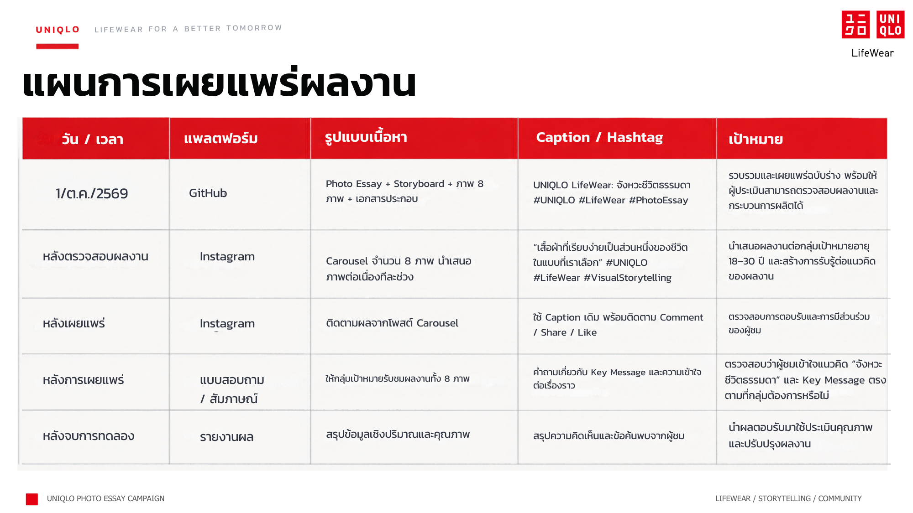

*ภาพที่ 5.4 แผนการแชร์ร่างและเผยแพร่ตามเอกสารนำเสนอ — ที่มา: STORYTELLING.pdf หน้า 25*

ตำแหน่งและวิธีวางภาพในรายงาน (ลบก่อนส่ง)

วางหลังตารางแผนที่เรียบเรียงใหม่ ภาพต้นทางเป็นแผน ไม่ใช่ภาพโพสต์ Instagram จริง ใช้ไฟล์ `slide-25.png` ที่เตรียมไว้ วางภาพกึ่งกลาง รักษาสัดส่วน และใส่คำบรรยายใต้ภาพ ความกว้างควรอยู่ในพื้นที่เนื้อหา ไม่เกินประมาณ 15 ซม. สำหรับ A4 ตามขอบเดิม

## 5.4 แนวทางการวัดผล

เสนอการทดลองขนาดเล็ก 5 คนเพื่อปรับงาน จำนวนนี้มาจากร่างแผนเดิม ไม่ใช่จำนวนที่ผู้สอนกำหนดหรือผลทดลองที่ทำแล้ว กรอบอายุในแผนส่วนท้ายสไลด์คือ 18–30 ปี ควรแยกผลของกลุ่มหลัก 18–25 ปีหากมีผู้ร่วมช่วง 26–30 ปี

| เป้าหมาย / ประเด็น | วิธีเก็บข้อมูล | สิ่งที่จะรายงาน |
|---|---|---|
| O1 เข้าใจสาร | “ถ้าสรุปงานนี้หนึ่งประโยค งานต้องการสื่ออะไร?” โดยไม่บอกสารล่วงหน้า | คำตอบจริงและเหตุผลการตีความ |
| O2 เชื่อมกับชีวิต / นำไปปรับใช้ | “ภาพไหนเกี่ยวกับชีวิตคุณ และทำให้คิดถึงการเลือกเสื้อผ้าอย่างไร?” | ตัวอย่างจากผู้ชม ไม่สรุปเป็นพฤติกรรมที่เปลี่ยนแล้ว |
| O3 แลกเปลี่ยน | “ถ้าเล่าจังหวะชีวิตหนึ่งของคุณ จะเลือกกิจกรรมและการแต่งตัวอย่างไร?” | เรื่องเล่าหรือคำตอบที่ผู้ชมยินดีให้ |
| ความต่อเนื่อง | ถามช่วงที่เชื่อมกับภาพก่อนหน้าได้ยาก | ตำแหน่งและเหตุผลในการปรับ |
| ความเหมาะสมของรูปแบบ | ถามความอ่านง่าย ความน่าสนใจ และช่องทางสะดวก | ความคิดเห็นต่อฉบับที่ทดลอง |
| การเข้าถึงงาน | เปิดลิงก์และไฟล์ด้วยสิทธิ์ผู้ชม | สถานะการเปิดอ่าน ไม่ใช้แทนความเข้าใจสาร |
| ปฏิสัมพันธ์สื่อสังคม | เก็บ Reach, Like, Comment, Share จากช่องทางที่มีข้อมูลจริง | รายงานช่วงเวลาและสถานะหลังโพสต์เท่านั้น |

แนวทางหลักอ้างหน้า 26 โดยเชื่อมกับ O1–O3 ที่กำหนดใน 1.2 บันทึกวันที่ ฉบับงาน วิธีคัดเลือก จำนวนจริง และช่วงอายุ ใช้รหัสผู้ร่วมแทนข้อมูลส่วนบุคคลที่ไม่จำเป็น

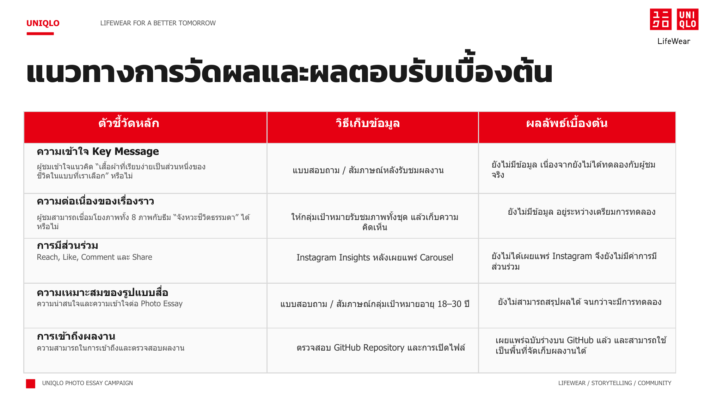

*ภาพที่ 5.5 แนวทางวัดผลและสถานะที่ยังไม่มีผลผู้ชม — ที่มา: STORYTELLING.pdf หน้า 26*

ตำแหน่งและวิธีวางภาพในรายงาน (ลบก่อนส่ง)

ใช้ตารางรายงานเป็นข้อมูลหลัก ภาพนี้ประกอบคำอธิบายแผน เก็บหัวตารางและสถานะผลเบื้องต้นให้ครบ ใช้ไฟล์ `slide-26.png` ที่เตรียมไว้ วางภาพกึ่งกลาง รักษาสัดส่วน และใส่คำบรรยายใต้ภาพ ความกว้างควรอยู่ในพื้นที่เนื้อหา ไม่เกินประมาณ 15 ซม. สำหรับ A4 ตามขอบเดิม

## 5.5 ผลลัพธ์หรือผลตอบรับเบื้องต้น

**สถานะ: มีชุดผลงานและเอกสารนำเสนอแล้ว ยังไม่มีผลทดลองผู้ชม**

| ประเภทผล | ข้อมูลที่มี / สถานะ |
|---|---|
| ผลผลิต | Photo Essay 8 ภาพ คำบรรยาย Storyboard และร่างรายงาน |
| เอกสารจัดหน้า | STORYTELLING.pdf 29 หน้า |
| การจัดเตรียมภาพรายงาน | ภาพสไลด์ครบ 29 หน้า ภาพที่สกัดได้ 104 ไฟล์ไม่ซ้ำ และทะเบียนย้อนกลับ |
| การแชร์งาน | Public repository; ภาพหน้าจอการเปิดอ่านอยู่ในภาคผนวก ง |
| ความเข้าใจ / ความต่อเนื่อง / ความเหมาะสม | ยังไม่มีคำตอบจากผู้ชม ตามสถานะในหน้า 26 |
| ปฏิสัมพันธ์ Instagram | ยังไม่มีข้อมูล เพราะยังไม่โพสต์ Carousel |
| การบรรลุ O1–O3 | ยังสรุปไม่ได้จนกว่าจะเก็บข้อมูล |

จำนวนไฟล์และการเปิดอ่านเป็นผลด้านการจัดเตรียมงาน ไม่ใช่ผลการรับรู้ของผู้ชม เมื่อเก็บข้อมูลแล้วให้เพิ่มคำตอบจริงพร้อมขอบเขตในภาคผนวก ง

## 5.6 การประเมินคุณภาพผลงานของกลุ่ม

**การประเมินเชิงเอกสารโดย Codex วันที่ 5 ตุลาคม 2569 — รอสมาชิกประเมินและยืนยันร่วมกัน**

| เกณฑ์ | หลักฐาน | ข้อประเมิน / สิ่งที่ต้องปรับ |
|---|---|---|
| สารหลัก | หน้า 17 และข้อความใน Photo Essay | สารเดียวกันและเชื่อมกับกิจกรรมได้; รอผลความเข้าใจ |
| ความต่อเนื่อง | หน้า 18–20 | ภาพครบและมีหน้าที่รายช่วง; อธิบาย Climax เป็นจุดเปลี่ยนจังหวะให้ชัด |
| ผู้ชม | หน้า 5–6, 14–16 และ 22, 25–28 | Persona ชัดขึ้น แต่ช่วงอายุยังไม่ตรงกันทั้งไฟล์ |
| ภาพและรูปแบบ | หน้า 2, 20 และ PDF 29 หน้า | มีเอกสารจัดหน้าแล้ว; ตารางหนาแน่นต้องตรวจเมื่อวางในรายงาน A4 |
| งานกลุ่ม | หน้า 23 | มีบทบาทครบ 6 คน; ชื่อหนึ่งคนต่างจากข้อมูลล่าสุด และต้องเติมหลักฐานรายบุคคล |
| การเข้าถึง | Repository และ Photo Essay ออนไลน์ | มี URL ที่เปิดอ่านได้; ปุ่มในหน้า 24 ไม่มี link annotation ใน PDF |
| ที่มาและจริยธรรม | หน้า 27 และทะเบียน P01–P08 | ชุดผลงานตรวจที่มาได้; ภาพประกอบอื่นใน PDF ยังต้องเติมแหล่งและสถานะสิทธิ์ |
| การวัดผล | หน้า 26 และ 5.4 | มีแผนเก็บผล; ยังไม่มีหลักฐานว่าบรรลุ O1–O3 |

ภาพแต่ละข้อแสดงในหัวข้อที่เกี่ยวข้องแล้ว จึงไม่ใส่ภาพเดิมซ้ำในส่วนนี้ เกณฑ์เป็นแนวทางพิจารณาคุณภาพ ไม่ใช่ rubric คะแนนทางการ

**ผู้ประเมินกลุ่ม / วันที่ / ข้อสรุป:** [ระบุหลังประเมินจริง]

# บทที่ 6 จริยธรรม ลิขสิทธิ์ และบทเรียนที่ได้รับ

## 6.1 การใช้ข้อมูล ภาพ เสียง และสื่อประกอบ

| สื่อ | ที่มา / วิธีใช้ | สถานะ |
|---|---|---|
| ภาพผลงาน P01–P08 | UNIQLO LifeWear magazine / Kohei Kawashima จาก The City Classics | เก็บภาพต้นฉบับและเครดิต ยังไม่มีเอกสารยืนยันอนุญาตเผยแพร่ซ้ำ |
| ภาพเต็มสไลด์ | STORYTELLING.pdf ที่ผู้จัดทำให้ | ใช้แสดงการออกแบบและข้อมูลที่กลุ่มนำเสนอ |
| ภาพ raster ที่สกัดจาก PDF | 104 ไฟล์ไม่ซ้ำ พร้อมหน้าและชื่อ image object ใน manifest | แหล่งภาพก่อนนำมาจัดสไลด์บางรายการยังไม่ทราบ ต้องเติมเครดิตรายภาพเมื่อใช้แยก |
| ข้อมูลแบรนด์ | คำอธิบาย LifeWear ทางการ | ใช้เป็นฐานแนวคิดและใส่อ้างอิง |
| คำบรรยาย / ลำดับ | งานเขียนและการคัดสรรของโครงงานด้วยความช่วยเหลือจาก Codex | แยกจากผู้สร้างภาพ |
| เสียง / วิดีโอ / เพลง | ไม่ใช้ใน Photo Essay นี้ | ไม่เกี่ยวข้อง |

การให้เครดิตสไลด์ไม่ยืนยันสิทธิ์ของภาพประกอบทั้งหมด ภาพสกัดจาก PDF เป็นองค์ประกอบที่ใช้ในเอกสาร ไม่ใช่หลักฐานว่ากลุ่มถ่ายเองหรือได้รับอนุญาตครบแล้ว สถานะสิทธิ์ต้องบันทึกตามหลักฐานจริง

## 6.2 การอ้างอิงแหล่งที่มา

| แหล่ง | วิธีใช้ / ตำแหน่ง |
|---|---|
| The City Classics / About LifeWear magazine | แหล่งภาพผลงาน 8 ภาพและแนวคิดแบรนด์; รายการเดิมในบรรณานุกรม |
| STORYTELLING.pdf | รายละเอียดผู้ชม Persona โครงเรื่อง บทบาท แผนเผยแพร่ และภาพสไลด์ที่กำกับเลขหน้า |
| เทมเพลตรายงานของผู้สอน | โครง 6 บท หัวข้อ 1.1–6.6 คำนำ บรรณานุกรม และภาคผนวก ก–จ |
| Digital_Storytelling_Report_Template.md | แนวทางขยายเหตุผล ช่องกรอก และหลักฐานของรายงาน |
| GitHub repository | หลักฐานการแชร์และประวัติแก้ไข |

รูปที่มาจาก PDF กำกับว่า “STORYTELLING.pdf หน้า …” ภาพ P01–P08 ใช้เครดิตต้นฉบับ ส่วนภาพองค์ประกอบที่นำมาใช้แยกควรมีเครดิตของแหล่งเดิมเพิ่มเติม ทะเบียนไฟล์อยู่ในโฟลเดอร์ภาพและ manifest

## 6.3 ความถูกต้องและความรับผิดชอบของเนื้อหา

การตรวจเนื้อหาแยกสิ่งที่มองเห็น ข้อมูลจากเอกสาร และการตีความเชิงธีม

| ประเด็นตรวจ | วิธีจัดการ |
|---|---|
| ชื่อ / รหัส / อาจารย์ | ใช้ข้อมูลล่าสุดจากผู้จัดทำ ไม่ถอดตามตัวสะกดที่ต่างในสไลด์ |
| ผู้ชม / Persona | เปิดเผยช่วงอายุที่ต่าง และระบุ Persona เป็นสมมติฐาน |
| โครงเรื่อง | Climax เป็นจุดเปลี่ยนความหมาย ไม่สร้างเหตุการณ์พีคให้บุคคล |
| ภาพประกอบ | แยก 8 ภาพของผลงานออกจากภาพอื่นที่ใช้จัดสไลด์ |
| บทบาท / งานทีม | อ้างหน้า 23 และ 28 เป็นข้อมูลที่กลุ่มระบุ ไม่ใช้แทนหลักฐานการทำงานรายคน |
| ผลผู้ชม | ยังไม่เติมคำตอบหรือยอดปฏิสัมพันธ์ที่ไม่ได้เก็บ |
| การเผยแพร่ | GitHub แชร์ร่างแล้ว; Instagram และการทดลองยังรอ |

สมาชิกต้องตรวจฉบับส่งและเติมบันทึกแก้ไขในหัวข้อ 6.4 โดยเฉพาะการยืนยันช่วงอายุและเครดิตภาพประกอบเพิ่มเติม

## 6.4 การใช้เครื่องมือ AI ในโครงงาน

| เครื่องมือ / ขั้นตอน | ขอบเขตการใช้ |
|---|---|
| Codex / Web Search | ค้นข้อมูล วางเรื่อง ร่างและทบทวน Markdown ตามขอบเขตเดิม |
| Python / Pillow | จัดการและตรวจไฟล์ภาพต้นฉบับ |
| Codex ในรอบรายงาน | อ่าน PDF เทียบเทมเพลต เติมข้อมูลกลุ่ม และวางภาพพร้อมคำแนะนำ |
| pypdf / Poppler | สกัดภาพที่ฝังและเรนเดอร์หน้า PDF ไม่สร้างบุคคลหรือฉากใหม่ |
| Playwright | จับภาพหน้า repository และ Photo Essay ที่เปิดอ่านจริง |
| การสร้างภาพ AI ของผลงาน 8 ภาพ | ไม่ใช้ในงานที่จัดทำในแชตนี้ ภาพมาจากแหล่งทางการ |
| การจัดทำ PDF โดยสมาชิก | [ยืนยันโปรแกรม การใช้ AI เพิ่มเติม และการตรวจแก้ที่ดำเนินการจริง] |

หน้า 27 อธิบายหลักการนำเสนออย่างรับผิดชอบและการใช้ AI เป็นผู้ช่วย สมาชิกต้องยืนยันเนื้อหาและการตัดสินใจสุดท้าย พร้อมบันทึกการตรวจโดยมนุษย์ ไม่อนุมานว่าได้ตรวจครบทุกภาพจากการมีสไลด์นี้เพียงอย่างเดียว

| ผู้ตรวจ | วันที่ | ส่วนที่แก้ / ตรวจ | เหตุผลหรือผลการตรวจ |
|---|---|---|---|
| [ระบุชื่อสมาชิก] | [ระบุ] | [ระบุ] | [ระบุ] |

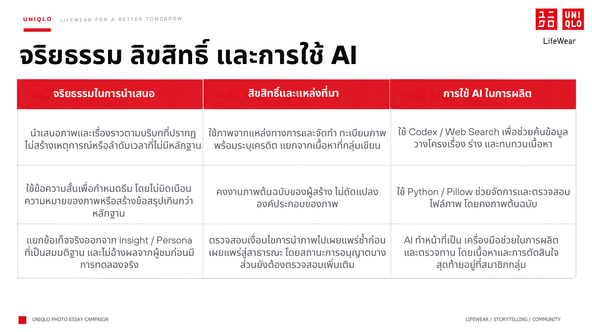

*ภาพที่ 6.1 จริยธรรม แหล่งภาพ และขอบเขตการใช้ AI ตามสไลด์ — ที่มา: STORYTELLING.pdf หน้า 27*

ตำแหน่งและวิธีวางภาพในรายงาน (ลบก่อนส่ง)

วางหลังบันทึก AI โดยไม่ใช้แทนเอกสารอนุญาตภาพหรือบันทึกตรวจแก้ของสมาชิก ใช้ไฟล์ `slide-27.png` ที่เตรียมไว้ วางภาพกึ่งกลาง รักษาสัดส่วน และใส่คำบรรยายใต้ภาพ ความกว้างควรอยู่ในพื้นที่เนื้อหา ไม่เกินประมาณ 15 ซม. สำหรับ A4 ตามขอบเดิม

## 6.5 บทเรียนที่ได้รับจากการทำโครงงาน

บทเรียนส่วนนี้เรียบเรียงจากการสะท้อนงานในหน้า 28 และการตรวจชุดเอกสาร

| ด้าน | บทเรียน | หลักฐาน / สิ่งที่ควรขยาย |
|---|---|---|
| เนื้อหา | ธีมจังหวะชีวิตเชื่อมภาพต่างสถานที่และสถานการณ์ได้ | อธิบายผ่านหน้าที่ของ P01–P08 ใน 3.2–3.6 |
| การผลิตสื่อ | การคัดภาพและข้อความสั้นมีผลต่อทิศทางการตีความ | ยกตัวอย่างจุดเปลี่ยนจาก P05 ไป P06 |
| การทำงานเป็นทีม | หน้า 28 ระบุการแบ่งบทบาทและทำงานต่อเนื่อง ตั้งแต่ค้นภาพจนเตรียมนำเสนอ | ให้สมาชิกเพิ่มหนึ่งเหตุการณ์จริง เช่น การส่งต่อ Storyboard หรือการตรวจคำบรรยาย พร้อมหลักฐาน |
| การจัดเอกสาร | สไลด์และรายงานต้องใช้ข้อมูลร่วมกัน แต่มีระดับรายละเอียดต่างกัน | รายงานขยายเหตุผล ระบุสถานะ และแยกภาพประกอบจากผลการดำเนินงาน |

ข้อสะท้อนด้านทีมเป็นสิ่งที่กลุ่มระบุในสไลด์ ยังไม่มีบันทึกเหตุการณ์เฉพาะในชุดที่ได้รับ จึงคงช่องเพิ่มเติมแทนการสร้างตัวอย่างเหตุการณ์ขึ้นเอง

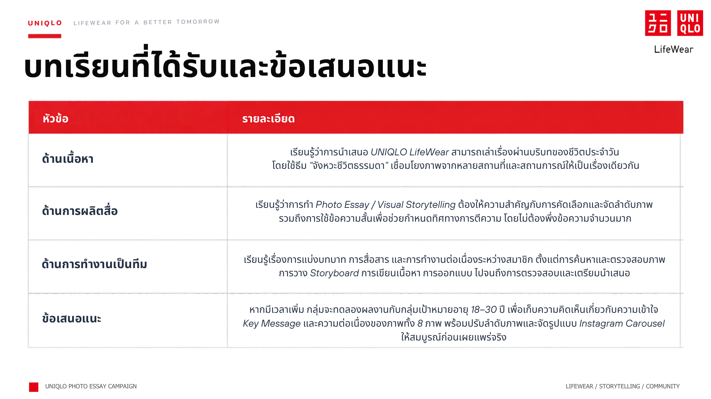

*ภาพที่ 6.2 บทเรียนและข้อเสนอพัฒนาที่กลุ่มสะท้อนในสไลด์ — ที่มา: STORYTELLING.pdf หน้า 28*

ตำแหน่งและวิธีวางภาพในรายงาน (ลบก่อนส่ง)

วางหลังตารางบทเรียน และเพิ่มเติมเหตุการณ์ทีมจริงตามช่องที่เว้นไว้ ใช้ไฟล์ `slide-28.png` ที่เตรียมไว้ วางภาพกึ่งกลาง รักษาสัดส่วน และใส่คำบรรยายใต้ภาพ ความกว้างควรอยู่ในพื้นที่เนื้อหา ไม่เกินประมาณ 15 ซม. สำหรับ A4 ตามขอบเดิม

## 6.6 ข้อเสนอแนะสำหรับการพัฒนาผลงานต่อไป

| ลำดับ | การพัฒนาต่อ | สิ่งที่จะตรวจ |
|---|---|---|
| 1 | ยืนยันข้อมูลร่วมของฉบับส่ง | ชื่อ ช่วงอายุ Persona โปรแกรมจัดสไลด์ และเงื่อนไขภาพ |
| 2 | ทดลองกับผู้ชมตาม 5.4 | ความเข้าใจสาร ความต่อเนื่อง การเชื่อมโยง และการแลกเปลี่ยน |
| 3 | ปรับภาพหรือคำบรรยายจากคำตอบจริง | บันทึกเหตุผลที่เปลี่ยนและผลการทดลองฉบับปรับเมื่อจำเป็น |
| 4 | จัด Instagram Carousel ให้พร้อมอ่าน | ภาพเต็ม เครดิต ข้อความ และวันเผยแพร่จริง |
| 5 | จัดรายงานจาก MD เป็นเอกสารส่ง | A4 เลขหน้า สารบัญ ภาพและคำบรรยายที่อ่านได้ |

รายการ 2–4 สอดคล้องข้อเสนอในหน้า 28 หากรายวิชาต้องการภาพถ่ายของกลุ่ม สามารถใช้ Storyboard เป็นแนวถ่ายภาพใหม่ และบันทึกผู้ร่วมถ่าย สถานที่ การยินยอม และเครดิตตามจริง

# บรรณานุกรม

รายการอ้างอิงใช้รูปแบบผู้แต่ง–ปี วันเผยแพร่ที่ไม่ระบุใช้ “ม.ป.ป.” และปรับรูปแบบตามข้อกำหนดผู้สอนในฉบับส่ง

UNIQLO. (2026). *The City Classics*. LifeWear magazine. สืบค้นเมื่อ 1 ตุลาคม 2569, จาก https://www.uniqlo.com/th/th/special-feature/lifewear-magazine/26fw/the-city-classics

UNIQLO. (ม.ป.ป.). *What is LifeWear magazine?* สืบค้นเมื่อ 1 ตุลาคม 2569, จาก https://www.uniqlo.com/us/en/special-feature/lifewear-magazine/about

เอกสารประกอบรายวิชา BS932116. (ม.ป.ป.). *Template รายงานโครงงานกลุ่มปลายภาค Digital Storytelling Project* [เอกสารประกอบรายวิชา; ไม่ระบุชื่อผู้จัดทำ]. ชื่อไฟล์: Digital Storytelling Project Report (1).pdf

เอกสารประกอบรายวิชา BS932116. (ม.ป.ป.). *Digital Storytelling Project: รูปแบบ PowerPoint สำหรับนักศึกษานำเสนอผลงานกลุ่มปลายภาค* [เอกสารประกอบรายวิชา; ไม่ระบุชื่อผู้จัดทำ]. ชื่อไฟล์: Digital_Storytelling_Project_Student_Presentation_Template.pdf

คณะผู้จัดทำโครงงาน UNIQLO LifeWear. (2569). *STORYTELLING* [สไลด์ PDF จำนวน 29 หน้า; ผู้จัดทำให้เพื่อใช้ประกอบรายงานเมื่อ 5 ตุลาคม 2569].

คณะผู้จัดทำโครงงาน UNIQLO LifeWear. (2569). *Digital Storytelling Report Template* [แม่แบบ Markdown ที่ปรับจากเอกสารผู้สอน; ใช้เป็นแนวทางโครงรายงาน].

เครดิตภาพใน The City Classics: Kohei Kawashima / UNIQLO LifeWear magazine; URL รายภาพอยู่ในทะเบียน P01–P08 ของ Photo Essay

---

# ภาคผนวก

## ภาคผนวก ก แบบร่างแนวคิดโครงงาน

**Concept Note — ปรับตามสไลด์ วันที่ 5 ตุลาคม 2569**

- ชื่อโครงงาน: UNIQLO LifeWear — เสื้อผ้าในจังหวะชีวิตธรรมดา
- รูปแบบ: Photo Essay 8 ภาพจากแหล่งทางการ พร้อมคำบรรยายใหม่
- ผู้ชมหลักตามหน้า 15: นักศึกษาและวัยเริ่มงาน 18–25 ปี
- กรอบทดลองในส่วนแผน: 18–30 ปี; รอทีมยืนยันฉบับส่ง
- Persona: โทมัส อายุ 22 ปี เป็นสมมติฐานการออกแบบ
- Big Idea: มองเสื้อผ้าผ่านกิจกรรมและจังหวะชีวิตของผู้สวมใส่
- Key Message: เสื้อผ้าที่เรียบง่ายเป็นส่วนหนึ่งของชีวิตในแบบที่เราเลือก
- โครงเรื่อง: Opening P01, Conflict P02, Development P03–P05, จุดเปลี่ยน P06, Resolution P07–P08
- สถานะ: มีผลงานและ PDF 29 หน้า; ยังไม่ได้โพสต์ Instagram หรือทดลองผู้ชม

## ภาคผนวก ข Storyboard / Script / Content Plan

Storyboard และคำบรรยายทั้ง 8 ภาพอยู่ในหัวข้อ 3.6 และ [Photo Essay MD](Uniqlo_LifeWear_PhotoEssay.md) ภาพเต็มที่ใช้ประกอบรายงานอยู่ที่ `assets/storytelling-report/photoessay/`

- [ภาพ Storyboard จาก PDF หน้า 20](assets/storytelling-report/slides/slide-20.png)
- [ภาพรวมชุดจาก PDF หน้า 2](assets/storytelling-report/slides/slide-02.png)

*ภาพที่ ข.1 ภาพ P01 สำหรับเปิดบริบทเมือง — เครดิต UNIQLO LifeWear magazine / Kohei Kawashima*

เมื่อต้องจัดฉบับเต็ม ให้ใส่ P01–P08 ตามลำดับ พร้อมรหัสและคำบรรยายใน 3.6 หรือใช้ Storyboard หน้า 20 โดยรักษาความอ่านง่าย

## ภาคผนวก ค ภาพกระบวนการผลิตผลงาน

**หลักฐานที่มี:** ไฟล์ผลงาน PDF สไลด์ ชุดภาพ ทะเบียน และประวัติ repository ภาพที่ 4.1–4.2 แสดงกระบวนการและบทบาทที่นำเสนอในสไลด์

**หลักฐานที่ยังรอ:** ภาพสมาชิกตรวจงาน ภาพประชุม ภาพการจัดหน้า และภาพซ้อมจริง ซึ่งไม่อยู่ในไฟล์ที่ได้รับ

| หลักฐาน | ตำแหน่ง / สิ่งที่แสดง |
|---|---|
| สไลด์อธิบายกระบวนการ | [หน้า 22](assets/storytelling-report/slides/slide-22.png) — แนวทางจัดทำ |
| เครื่องมือและบทบาท | [หน้า 23](assets/storytelling-report/slides/slide-23.png) — การแบ่งความรับผิดชอบ |
| องค์ประกอบภาพที่ใช้ | [manifest.json](assets/storytelling-report/manifest.json) — ไฟล์ที่สกัดและหน้าที่พบ |
| ประวัติร่าง | [ประวัติ GitHub](https://github.com/uhactuallyidk/uniqlo-lifewear-photo-essay/commits/main/) — การอัปโหลดและแก้ไขไฟล์ |

[ใส่ภาพการทำงานจริง พร้อมวัน ผู้เกี่ยวข้อง และคำบรรยายเมื่อมีหลักฐาน] ภาพบุคคลหรือร้านประกอบสไลด์ไม่ใช้แทนภาพสมาชิกปฏิบัติงาน

## ภาคผนวก ง หลักฐานการเผยแพร่หรือทดลองนำเสนอ

**การแชร์ที่มีหลักฐาน:** GitHub Public และหน้า Photo Essay ที่เปิดอ่านได้ ภาพต่อไปนี้จับก่อนเพิ่ม PDF ในรอบวันที่ 5 ตุลาคม 2569 จึงใช้ยืนยันการแชร์ร่างที่มีเดิม

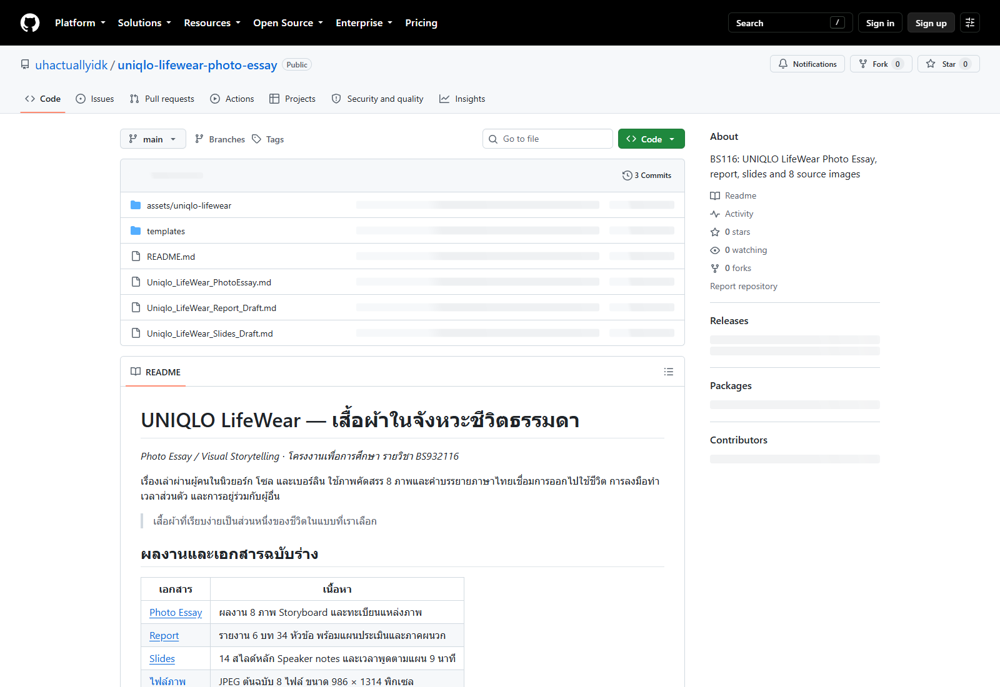

*ภาพที่ ง.1 หน้า repository ที่เปิดอ่านโดยไม่ลงชื่อเข้าใช้ จับภาพวันที่ 5 ตุลาคม 2569 ก่อนเพิ่ม STORYTELLING.pdf ในรอบนี้*

การเปิดอ่าน Photo Essay แสดงในภาพที่ 5.3 ส่วน [PDF](https://github.com/uhactuallyidk/uniqlo-lifewear-photo-essay/blob/main/STORYTELLING.pdf) และไฟล์รายงานรอบนี้ตรวจได้จาก repository หลังอัปโหลด

**Instagram / ผลทดลอง:** ยังไม่มีโพสต์หรือข้อมูลผู้ชมจริง แบบบันทึกสำหรับขั้นถัดไป:

| รายการ | ข้อมูลจริงเมื่อดำเนินการ |
|---|---|
| วัน / ฉบับ / วิธีรับชม | [ระบุ] |
| จำนวนและวิธีคัดเลือก / ช่วงอายุ | [ระบุ] |
| O1 สารที่จำได้ | [บันทึกคำตอบจริง] |
| O2 ภาพที่เกี่ยวข้องและแนวทางปรับใช้ | [บันทึกคำตอบจริง] |
| O3 เรื่องเล่าที่แลกเปลี่ยน | [บันทึกคำตอบจริง] |
| ช่วงที่เชื่อมไม่ทัน | [บันทึกคำตอบจริง] |
| หลักฐานและข้อจำกัด | [ระบุ] |

## ภาคผนวก จ หลักฐานแหล่งที่มาของสื่อ

แหล่งภาพผลงาน P01–P08 พร้อม URL และเครดิตเต็มอยู่ใน [Photo Essay](Uniqlo_LifeWear_PhotoEssay.md) โฟลเดอร์เดียวกันเก็บสไลด์และองค์ประกอบเพิ่มเติมเพื่อให้ตรวจย้อนกลับได้

| ประเภท | หลักฐาน |
|---|---|
| ภาพผลงาน 8 ภาพ | [photoessay/](assets/storytelling-report/photoessay/) — ต้นฉบับที่เก็บไว้ |
| ภาพสไลด์ 29 หน้า | [slides/](assets/storytelling-report/slides/) — เรนเดอร์จาก PDF ที่ได้รับ |
| ภาพ raster 104 ไฟล์ไม่ซ้ำ | [elements/](assets/storytelling-report/elements/) — ภาพที่สกัดจาก PDF |
| ทะเบียนเชื่อมหน้ากับภาพ | [manifest.json](assets/storytelling-report/manifest.json) และ [ดัชนีภาพ](assets/storytelling-report/README.md) |
| เทมเพลตรายงาน PDF ต้นทาง | [เอกสารผู้สอน](assets/storytelling-report/references/Digital_Storytelling_Professor_Report_Template.pdf) |
| เทมเพลตรายงาน MD | [แม่แบบที่มีเดิม](assets/storytelling-report/references/Digital_Storytelling_Report_Template.md) |
| เอกสารสิทธิ์ภาพ | ภาพผลงาน 8 ภาพและภาพประกอบอื่นยังไม่มีเอกสารอนุญาตครบในชุดที่ได้รับ |

ภาพสกัดที่พบหลายหน้าเก็บไฟล์เดียวแล้วบันทึกทุกหน้าที่ใช้ การสกัดไม่ทำให้ทราบเจ้าของภาพก่อนจัดสไลด์โดยอัตโนมัติ หากเลือกไฟล์จาก elements ไปใช้แยก ต้องเติมแหล่งต้นฉบับและเครดิตที่ตรวจได้

## การจัดรูปแบบเมื่อทำรายงานส่ง

ใช้ A4, TH Sarabun New 16 หรือรูปแบบผู้สอน ขอบซ้าย 1.5 นิ้ว ขวา บน ล่างด้านละ 1 นิ้ว จัดข้อความชิดขอบสองด้าน ใส่เลขหน้าและสารบัญให้ตรงกับฉบับสุดท้าย MD นี้ยังไม่ตั้งค่าหน้ากระดาษหรือเลขหน้าให้เอง

---

# คู่มือปรับรายงานและเลือกภาพ — ลบส่วนนี้ก่อนส่ง

## ฐานข้อกำหนดที่ใช้

1. [เทมเพลตรายงานของผู้สอนฉบับ PDF](assets/storytelling-report/references/Digital_Storytelling_Professor_Report_Template.pdf) — โครงหัวข้อและรูปแบบส่ง
2. [เทมเพลตรายงาน MD ที่มีเดิม](assets/storytelling-report/references/Digital_Storytelling_Report_Template.md) — วิธีขยายเหตุผล ช่องกรอก และหลักฐาน
3. [STORYTELLING.pdf](STORYTELLING.pdf) — รายละเอียดและภาพการนำเสนอชุดล่าสุด

เทมเพลตเดิมเป็นฐานหัวข้อ สไลด์เป็นแหล่งรายละเอียดเพิ่ม ไม่ย้ายลำดับสไลด์มาแทนลำดับรายงาน คง 6 บท 34 หัวข้อ รวม 5.6 ซึ่งปรากฏในสารบัญ PDF ผู้สอน แม้ส่วนเนื้อหาเดิมไม่มีช่องกรอกเฉพาะ

## สิ่งที่ปรับเพิ่มจากเทมเพลตและสไลด์

- เติมชื่อและรหัส 6 คน อาจารย์ และชื่อรายวิชาทั้งสองภาษา
- ขยายวัตถุประสงค์เป็น O1–O3 ตามหน้า 14 และเชื่อมกับวิธีวัดผล
- ใช้ Persona โทมัส อายุ 22 ปีตามหน้า 16 พร้อมเปิดเผยสถานะสมมติฐาน
- อธิบาย Opening–Conflict–Development–Climax–Resolution ให้สัมพันธ์กับภาพจริง โดยไม่แต่งเหตุการณ์
- เติมบทบาทจากหน้า 23 และช่องหลักฐานรายคน
- ระบุว่า PDF จัดหน้าแล้ว แยกจาก Carousel และการทดลองที่ยังรอ
- ใส่ภาพจริงพร้อมคำบรรยายและวิธีวาง โดยไม่ใช้ภาพสไลด์แทนผลผู้ชมหรือภาพทีม

## ตารางเทียบข้อกำหนดเดิมกับรายละเอียดจากสไลด์

| หัวข้อในเทมเพลต | หน้าที่ที่ต้องมีในรายงาน | หน้า PDF ที่ใช้ / สิ่งที่เพิ่มในร่าง |
|---|---|---|
| 1.1 | บริบทและเหตุผลเลือกประเด็น | 4, 13 — เชื่อม LifeWear กับกิจกรรมและเหตุผลใช้ภาพ |
| 1.2 | วัตถุประสงค์การสื่อสารที่ตรวจได้ | 5, 14 — O1 เข้าใจ O2 เชื่อมโยง O3 แลกเปลี่ยน |
| 1.3 | ขอบเขตเนื้อหา ผู้ชม สื่อ ช่องทาง เวลา | 14–15, 22, 25–28 — แสดงช่วงอายุสองชุดอย่างเปิดเผย |
| 1.4 | ประโยชน์ที่คาดหวัง | 14 — แยกผลที่คาดจากผลทดลอง |
| 2.1 | กลุ่มเป้าหมายพร้อมเหตุผล | 6, 15 — ผู้ชมหลัก 18–25 ปี |
| 2.2 | พฤติกรรมสื่อและผลต่อการออกแบบ | 15 — ตารางช่องทางเป็นสมมติฐาน |
| 2.3 | Insight พร้อมที่มา | 6, 16 — แนวคิดชีวิตและตัวตน ยังไม่ใช่ผลวิจัย |
| 2.4 | Persona อย่างน้อยหนึ่งคน | 16 — โทมัส 22 ปี แทน Persona ร่างเดิม |
| 2.5 | Big Idea | 7, 17 — ใช้ข้อความแนวคิดเดิม |
| 2.6 | Key Message หนึ่งประเด็น | 17 — ใช้สารเดียวกับผลงาน |
| 3.1 | ประเภทเรื่องและเหตุผล | 18 — Brand Storytelling / Photo Essay |
| 3.2 | โครงสร้างและหน้าที่แต่ละช่วง | 18–19 — อธิบาย Climax เป็นจุดเปลี่ยนจังหวะ |
| 3.3 | ตัวละครหรือผู้เล่า | 21 — หลายคนและกิจกรรม ไม่แต่งประวัติ |
| 3.4 | ความขัดแย้งหรือโจทย์เรื่อง | 18, 21 — คำถามเรื่องความเรียบง่ายกับตัวตน |
| 3.5 | อารมณ์และบรรยากาศ | 21 — เปลี่ยนจากเมืองสู่ช่วงสงบและร่วมกัน |
| 3.6 | Storyboard / บท / แผนเต็ม | 2, 20 — ภาพครบ P01–P08 พร้อมคำบรรยายในรายงาน |
| 4.1 | รูปแบบสื่อและเหตุผล | 12, 24 — แยกภาพผลงานจากภาพตกแต่งสไลด์ |
| 4.2 | เหตุผลเลือกแพลตฟอร์ม | 15, 25 — GitHub ที่มีแล้วและ Instagram ที่เสนอ |
| 4.3 | ขั้นตอนที่ทำจริง | 9, 22 — กระบวนการและสถานะสิ่งส่งมอบ |
| 4.4 | เครื่องมือที่ใช้จริง | 23 — รายการเดิมและเครื่องมืออ่าน PDF รอบรายงาน |
| 4.5 | บทบาทสมาชิก | 23 — ข้อมูลชื่อใหม่พร้อมรหัสและช่องหลักฐาน |
| 4.6 | ปัญหาและวิธีแก้ | ตรวจทั้งชุด — ช่วงอายุ Persona ชื่อ และแหล่งภาพ |
| 5.1 | รายละเอียดผลงาน | 2, 20, 24 — Photo Essay 8 ภาพและ PDF 29 หน้า |
| 5.2 | Link / QR ที่เปิดได้ | 24 — ไม่พบ link annotation จึงให้ URL จริง |
| 5.3 | วัน ช่องทาง รูปแบบ Caption เป้าหมาย | 25 — แยกแผนออกจากการแชร์ที่เกิดขึ้นแล้ว |
| 5.4 | วิธีวัดผลกับวัตถุประสงค์ | 26 — เพิ่มคำถามสำหรับ O1–O3 |
| 5.5 | ผลผลิตและผลตอบรับจริง | 26 — ไม่มีผลผู้ชม คงสถานะตามจริง |
| 5.6 | ประเมินคุณภาพโดยมีหลักฐาน | 17–28 — ประเมินเอกสาร รอสมาชิกยืนยันร่วมกัน |
| 6.1 | สื่อที่ใช้และสถานะสิทธิ์ | 27 — แยกเครดิต 8 ภาพกับภาพประกอบอื่น |
| 6.2 | อ้างอิงแหล่งข้อมูล | 27 และแหล่งเดิม — เพิ่ม PDF และทะเบียนองค์ประกอบ |
| 6.3 | ความถูกต้องและความรับผิดชอบ | 27 — ตรวจข้อมูลที่ไม่ตรงและการกล่าวอ้าง |
| 6.4 | AI และการตรวจโดยมนุษย์ | 27 — เปิดเผยงานรอบนี้และช่องยืนยันสมาชิก |
| 6.5 | บทเรียนจากงานจริง | 28 — ใช้สิ่งที่กลุ่มสะท้อน รอเหตุการณ์ทีมเฉพาะ |
| 6.6 | แนวทางพัฒนาต่อ | 28 — ทดลอง ปรับ จัด Carousel และรายงานส่ง |

ส่วนปก คำนำ สารบัญ บรรณานุกรม และภาคผนวก ก–จ ยังคงอยู่ ภาพที่ยังไม่มีหลักฐานการประชุมหรือทดลองไม่เติมแทนด้วยภาพประกอบแบรนด์

## ควรแคปหน้าไหนและแคปส่วนใด

ภาพเต็มทุกหน้าเตรียมไว้แล้ว ไม่จำเป็นต้องแคปใหม่จากจอ สำหรับการวางใน Word / Docs ใช้ไฟล์ PNG เพื่อให้ไม่มีขอบโปรแกรม PDF Viewer หน้าในตารางคือเลขหน้าไฟล์ PDF เริ่มนับปกเป็นหน้า 1

| หน้า | ส่วนที่ควรใช้ | วางในรายงาน | แนวเลือกภาพ |
|---|---|---|---|
| 13 | ที่มาและเหตุผลเลือกแนวคิด LifeWear | 1.1 / ภาพ 1.1 | วางกึ่งกลางหลังย่อหน้าที่อธิบายเหตุผล ใช้เป็นภาพประกอบแนวคิด ไม่ใช้ภาพร้านเป็นหลักฐานสถานที่ผลิตของกลุ่ม |
| 14 | วัตถุประสงค์และขอบเขตที่แสดงในเอกสารนำเสนอ | 1.2 / ภาพ 1.2 | วางหลังตาราง O1–O3 คงตารางรายงานเป็นข้อความแก้ไขได้ ภาพนี้แสดงการนำแนวคิดไปจัดหน้า |
| 15 | กลุ่มเป้าหมายและการเปรียบเทียบช่องทางตามสมมติฐาน | 2.2 / ภาพ 2.1 | หากข้อความเล็ก ให้ใช้ด้านซ้ายกับด้านขวาเป็นภาพย่อย (ก)–(ข) หรือย้ายภาพเต็มไปภาคผนวก ตารางรายงานยังต้องอ่านได้โดยไม่พึ่งภาพ |
| 16 | Persona โทมัสและ Audience Insight สำหรับการออกแบบ | 2.4 / ภาพ 2.2 | วางหลังตาราง Persona หากต้องครอป เลือกข้อความ Persona และ Insight โดยคงป้ายชื่อกับอายุ ภาพบุคคลไม่ใช่หลักฐานผู้ให้ข้อมูลจริง |
| 17 | Big Idea และ Key Message ของโครงงาน | 2.6 / ภาพ 2.3 | วางหลังเหตุผลเลือกสารหลัก หากครอปให้เก็บทั้ง Big Idea และ Key Message พร้อมหัวข้อ |
| 18 | Opening และ Conflict ในการออกแบบลำดับภาพ | 3.2 / ภาพ 3.1 | ใช้หน้า 18–19 ต่อเนื่องกันหรือเป็นภาพย่อยสองภาพ ห้ามใช้ภาพแฟชั่นประกอบหน้า 18 แทนภาพ P01–P02 ของผลงาน |
| 19 | Development จุดเปลี่ยนจังหวะ Resolution และ CTA | 3.2 / ภาพ 3.2 | คงข้อความบทบาทของภาพและ CTA ด้านล่าง อ่านร่วมกับตาราง 3.2 ที่อธิบาย Climax เชิงธีม |
| 21 | ผู้คน โจทย์เรื่อง และอารมณ์ของชุดภาพ | 3.5 / ภาพ 3.3 | วางหลังตารางอารมณ์ หากข้อความเล็กให้แบ่งข้อความสามส่วนเป็นภาพย่อย และคงภาพเต็มไว้ในโฟลเดอร์ |
| 20 | Storyboard 8 ภาพตามลำดับ P01–P08 | 3.6 / ภาพ 3.4 | ใช้เต็มหน้าแนวนอนเมื่อส่งออก หรือวางกว้างประมาณพื้นที่เนื้อหา A4 โดยตรวจชื่อช่วง หากเล็กเกินอ่านให้ใช้สองแถวเป็นภาพย่อย |
| 22 | กระบวนการจัดทำที่แสดงในสไลด์ | 4.3 / ภาพ 4.1 | วางหลังตารางขั้นตอน เป็นภาพอธิบายกระบวนการ ไม่ใช่หลักฐานว่าประชุมหรือทดลองผู้ชมแล้ว |
| 23 | เครื่องมือและการแบ่งบทบาทตามเอกสารนำเสนอ | 4.5 / ภาพ 4.2 | รายงานใช้ตารางชื่อที่แก้ตามข้อมูลล่าสุด ภาพสไลด์คงต้นฉบับ หากข้อความเล็กให้แยกส่วนเครื่องมือและสมาชิก |
| 2 | ภาพรวม Photo Essay 8 ภาพ | 5.1 / ภาพ 5.1 | ใช้หน้า 2 หรือหน้า 20 เพื่อแสดงชิ้นงาน 8 ภาพ ไม่ใช้ภาพแฟชั่นอื่นในหน้า 24 แทนผลงาน |
| 25 | แผนการแชร์ร่างและเผยแพร่ตามเอกสารนำเสนอ | 5.3 / ภาพ 5.4 | วางหลังตารางแผนที่เรียบเรียงใหม่ ภาพต้นทางเป็นแผน ไม่ใช่ภาพโพสต์ Instagram จริง |
| 26 | แนวทางวัดผลและสถานะที่ยังไม่มีผลผู้ชม | 5.4 / ภาพ 5.5 | ใช้ตารางรายงานเป็นข้อมูลหลัก ภาพนี้ประกอบคำอธิบายแผน เก็บหัวตารางและสถานะผลเบื้องต้นให้ครบ |
| 27 | จริยธรรม แหล่งภาพ และขอบเขตการใช้ AI ตามสไลด์ | 6.4 / ภาพ 6.1 | วางหลังบันทึก AI โดยไม่ใช้แทนเอกสารอนุญาตภาพหรือบันทึกตรวจแก้ของสมาชิก |
| 28 | บทเรียนและข้อเสนอพัฒนาที่กลุ่มสะท้อนในสไลด์ | 6.5 / ภาพ 6.2 | วางหลังตารางบทเรียน และเพิ่มเติมเหตุการณ์ทีมจริงตามช่องที่เว้นไว้ |

หน้า 1 และ 29 เป็นปกกับหน้าขอบคุณ เก็บไว้เพื่อความครบของเอกสารแต่ไม่จำเป็นต้องใส่เนื้อหารายงาน หน้า 24 ใช้อ้างรายละเอียดและตำแหน่งคำชวนเปิดออนไลน์ได้ แต่ใช้หน้า 2 หรือ 20 แสดงผลงาน 8 ภาพให้ชัดกว่า

## วิธีใส่ภาพเมื่อจัดรายงานส่ง

1. ใช้ภาพหลังย่อหน้าที่อธิบายเหตุผลหรือหลังตารางที่กล่าวถึงภาพนั้น
2. วางกึ่งกลาง รักษาสัดส่วน ความกว้างไม่เกินพื้นที่เนื้อหา A4 ตามขอบซ้าย 1.5 นิ้ว ด้านอื่น 1 นิ้ว
3. ใช้คำบรรยาย “ภาพที่ …” และหน้าต้นทางใต้ภาพ แล้วกล่าวถึงเลขภาพในเนื้อหา
4. ตารางแน่น เช่นหน้า 15, 23, 25–28 ให้คงตารางที่พิมพ์ใหม่ในรายงานเป็นข้อมูลหลัก หากภาพเล็กให้แยกภาพย่อยหรือวางหน้าแนวนอนในภาคผนวก
5. ภาพบุคคลและร้านในสไลด์เป็นภาพประกอบ ไม่ใช้ยืนยัน Persona ผู้ให้ข้อมูล หรือการทำงานของสมาชิก
6. ลบคู่มือนี้และคำแนะนำจัดภาพในแต่ละส่วนก่อนส่ง พร้อมเติมข้อมูลที่ยังรอ

## จุดที่ทีมควรยืนยันก่อนส่ง

- [ ] วันส่งรายงาน
- [ ] ใช้ช่วงอายุเดียวทั้งฉบับส่ง หรือยืนยันการแยกผู้ชมหลักกับกรอบทดลอง
- [ ] รายงานใช้ Persona โทมัสตาม PDF; หากรวมร่างอื่น ต้องตรวจ Persona ให้ตรงกัน
- [ ] ใช้ “ปุรัสกร อ้วนพรมมา” ตามข้อมูลล่าสุด และตรวจชื่อทุกไฟล์ฉบับส่ง
- [ ] โปรแกรมที่ใช้จัด PDF และขอบเขต AI ที่สมาชิกใช้เพิ่มเติม
- [ ] หลักฐานบทบาทสมาชิก เหตุการณ์ทีมจริง และบันทึกตรวจแก้
- [ ] แหล่งและสิทธิ์ภาพประกอบที่ไม่ใช่ P01–P08
- [ ] ข้อมูลทดลองและผลตอบรับจริงก่อนสรุปว่าบรรลุวัตถุประสงค์
