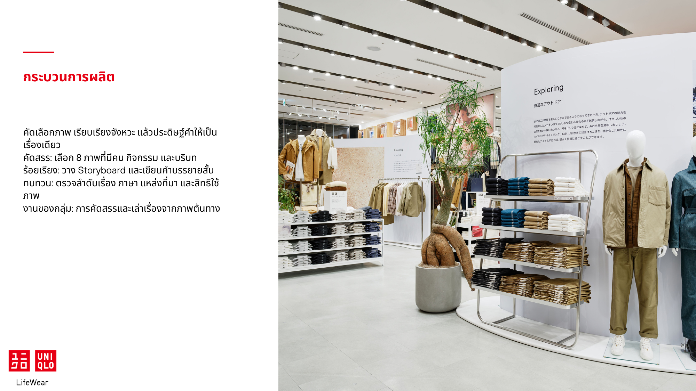
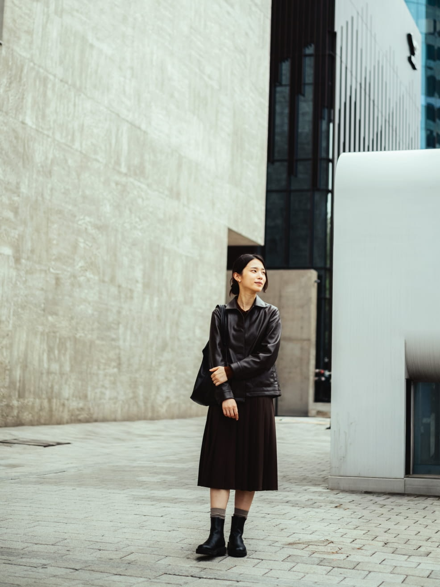

# รายงานโครงงาน Digital Storytelling

## UNIQLO LifeWear เสื้อผ้าในจังหวะชีวิตธรรมดา

**รูปแบบผลงาน:** Photo Essay และ Visual Storytelling จำนวน 8 ภาพ

**รายวิชา:** BS932116 Storytelling for Digital Communication

**ชื่อรายวิชาภาษาไทย:** การเล่าเรื่องสำหรับการสื่อสารทางดิจิทัล

**เสนอ:** ผศ.ดร.กัมปนาท ศิริโยธา

**มหาวิทยาลัยขอนแก่น**

| สมาชิก | รหัสนักศึกษา |
| --- | --- |
| พนัสชัย แก้วสอนดี | 673210269-9 |
| จักรพันธ์ อะวิสัย | 673210575-2 |
| ปราณปริยา เวชกามา | 673210585-9 |
| ปรมัตถ์ ทัศณรงค์ | 673210844-1 |
| ปุรัสกร อ้วนพรมมา | 673210268-1 |
| ณดล วิทักษบุตร | 673210836-0 |

# คำนำ

รายงานฉบับนี้นำเสนอโครงงาน UNIQLO LifeWear เสื้อผ้าในจังหวะชีวิตธรรมดา ในรูปแบบ Photo Essay จำนวน 8 ภาพ โดยคัดสรรภาพทางการแล้วจัดลำดับและเขียนคำบรรยายภาษาไทย เพื่อเชื่อมเสื้อผ้าเข้ากับกิจกรรมและการแสดงตัวตนในชีวิตประจำวัน

เนื้อหาอธิบายตั้งแต่ที่มาและผู้ชมเป้าหมายไปสู่แนวคิด การออกแบบเรื่อง การผลิต และการประเมิน พร้อมภาพประกอบและผลงานครบชุดในภาคผนวก ก–ข ผลงานปัจจุบันเป็นฉบับสำหรับการศึกษา ส่วนการเผยแพร่บน Instagram และการทดลองกับผู้ชมยังไม่ได้ดำเนินการ

คณะผู้จัดทำ

# สารบัญ

- บทที่ 1 ที่มาและเป้าหมายของโครงงาน
- บทที่ 2 จากผู้ชมสู่แนวคิดการสื่อสาร
- บทที่ 3 การออกแบบเรื่องด้วยภาพ
- บทที่ 4 การผลิตและการทำงานร่วมกัน
- บทที่ 5 ผลงาน การเผยแพร่ และการประเมิน
- บทที่ 6 ความรับผิดชอบและบทเรียน
- บรรณานุกรม
- ภาคผนวก ก แบบร่างแนวคิดโครงงาน
- ภาคผนวก ข ชุดภาพและคำบรรยาย

# บทที่ 1 ที่มาและเป้าหมายของโครงงาน

## 1.1 เสื้อผ้าในบริบทของชีวิตประจำวัน

เสื้อผ้าเป็นส่วนหนึ่งของกิจวัตรและการแสดงตัวตน โครงงานนี้จึงเลือกเล่าแบรนด์ผ่านผู้คนและสิ่งที่พวกเขาทำ มากกว่าการนำเสนอสินค้าแยกจากบริบท แนวคิด LifeWear ของ UNIQLO ซึ่งให้ความสำคัญกับเสื้อผ้าสำหรับชีวิตประจำวัน เป็นฐานของเรื่อง (UNIQLO, ม.ป.ป.)

ชุดภาพ The City Classics แสดงผู้คนในนิวยอร์ก โซล และเบอร์ลิน จึงนำมาเชื่อมด้วยธีมชีวิตธรรมดาได้ โดยคงสถานที่จริงและไม่เล่าว่าเป็นวันเดียวกันหรือชีวิตของคนคนเดียว (UNIQLO, 2026) รูปแบบ Photo Essay ให้ภาพสร้างบริบทและใช้ข้อความสั้นเชื่อมความหมาย ผู้ชมจึงค่อย ๆ อ่านและตีความได้ตามจังหวะของตน

*ภาพที่ 1.1 เสื้อผ้า กิจกรรม และแนวคิด LifeWear*

## 1.2 เป้าหมายและขอบเขตการสื่อสาร

โครงงานต้องการให้ผู้ชมเข้าใจความสัมพันธ์ระหว่างเสื้อผ้าที่เรียบง่ายกับชีวิตประจำวัน เห็นแนวทางเลือกแต่งตัวให้เข้ากับกิจกรรม และแลกเปลี่ยนมุมมองเกี่ยวกับการแต่งตัวในแบบของตนเอง

ขอบเขตงานคือภาพนิ่ง 8 ภาพพร้อมคำบรรยายภาษาไทย สำหรับนักศึกษาและวัยเริ่มทำงานอายุประมาณ 18–25 ปี เนื้อหาครอบคลุมชีวิตในเมือง การเลือกสไตล์ งานสร้างสรรค์ ความสนใจส่วนตัว การพัก และการอยู่ร่วมกับผู้อื่น เสนอเผยแพร่ผ่าน Instagram Carousel โดยไม่ใช้เสียง เพลง หรือวิดีโอ

ประโยชน์ที่คาดหวังคือผู้ชมได้พิจารณาเสื้อผ้าผ่านกิจวัตรของตน ส่วนผู้จัดทำได้ฝึกการคัดภาพ ลำดับเรื่อง และการใช้สื่ออย่างมีความรับผิดชอบ ผลต่อผู้ชมยังต้องตรวจด้วยการประเมินจริง

# บทที่ 2 จากผู้ชมสู่แนวคิดการสื่อสาร

## 2.1 ผู้ชมเป้าหมายและสิ่งที่ต้องการสื่อสารด้วย

ผู้ชมหลักคือนักศึกษาและวัยเริ่มทำงานอายุประมาณ 18–25 ปี Insight ตั้งต้นคือความต้องการเสื้อผ้าที่เข้ากับกิจวัตรและสะท้อนตัวตน เป็นสมมติฐานจากการตีความ LifeWear และกิจกรรมในภาพ ยังไม่มีผลสำรวจหรือสัมภาษณ์รองรับ

ใช้ Persona สมมติ “โทมัส อายุ 22 ปี” ซึ่งสนใจการแต่งตัวให้เข้ากับกิจกรรม รับเนื้อหาผ่านสมาร์ตโฟน และอาจหลีกเลี่ยงการขายตรง จึงให้ภาพนำเรื่อง ใช้ข้อความสั้น และเสนอ Carousel ที่ย้อนดูได้ พฤติกรรมเหล่านี้ยังต้องตรวจจริง

*ภาพที่ 2.1 ตัวแทนสมมติของผู้ชมและ Audience Insight*

## 2.2 แนวคิดหลักและสารที่ต้องการให้ผู้ชมจดจำ

**Big Idea: มองเสื้อผ้าผ่านกิจกรรมและจังหวะชีวิตของผู้สวมใส่**

เลือกภาพหลายคนและหลายกิจกรรมเพื่อเชื่อมกับสารหลัก **“เสื้อผ้าที่เรียบง่ายเป็นส่วนหนึ่งของชีวิตในแบบที่เราเลือก”** โดยเน้นการเลือกของผู้สวมใส่ และไม่อ้างคุณสมบัติสินค้าเกินสิ่งที่เห็น

# บทที่ 3 การออกแบบเรื่องด้วยภาพ

## 3.1 แนวทางการเล่าเรื่องและจังหวะอารมณ์

ใช้ Brand Storytelling ผ่าน Photo Essay โดยให้ผู้คนหลายคนเป็นองค์ประกอบของเรื่อง และให้คำบรรยายภาษาไทยเป็นเสียงผู้เล่า โครงสร้างเป็น Beginning–Middle–End เชิงธีม เชื่อมภาพต่างสถานที่ผ่านกิจกรรม ไม่สร้างเหตุการณ์ต่อเนื่องของตัวละครคนเดียว

คำถามที่ชวนติดตามคือ เสื้อผ้าที่เรียบง่ายสัมพันธ์กับกิจกรรมและตัวตนที่ต่างกันได้อย่างไร เรื่องตอบผ่านความหลากหลายของคนและบริบท จังหวะเริ่มจากความเคลื่อนไหวของเมืองไปสู่การลงมือทำ ความสนใจ และการพัก ก่อนกลับสู่การเดินร่วมกัน ใช้โทนเป็นกันเองและเปิดให้ตีความ ภาพ P06 เป็นจุดผ่อนจังหวะ ไม่ใช่เหตุการณ์พีคของตัวละคร

## 3.2 ลำดับภาพและการเชื่อมความหมาย

ช่วงเปิด P01–P02 ใช้ภาพเดินในเมืองและชายสวมแจ็คเก็ตสีส้มถือกล้อง เพื่อเชื่อมชีวิตประจำวันกับสิ่งที่แต่ละคนเลือก ช่วงขยาย P03–P05 พาไปสู่สตูดิโอเซรามิก ร้านหนังสือ และพื้นที่เมือง เพื่อเห็นกิจกรรมและความสนใจที่หลากหลาย

P06 เว้นจังหวะด้วยภาพถือถ้วยในคาเฟ่ ก่อนปิดด้วย P07–P08 ซึ่งเชื่อมการเดินร่วมกันกับสารหลัก คำชวนท้ายเรื่องคือ “จังหวะชีวิตแบบไหนที่เป็นคุณ และคุณเลือกแต่งตัวอย่างไรในวันธรรมดา” ภาพและคำบรรยายครบชุดอยู่ในภาคผนวก ข

*ภาพที่ 3.1 ลำดับภาพ Photo Essay ทั้ง 8 ภาพ*

# บทที่ 4 การผลิตและการทำงานร่วมกัน

## 4.1 จากการคัดภาพสู่ผลงาน

กระบวนการเริ่มจากกำหนดประเด็นและผู้ชม ศึกษา LifeWear แล้วคัดและดาวน์โหลดภาพจาก The City Classics โดยเลือกให้แต่ละภาพมีหน้าที่ต่างกัน จากนั้นเรียง P01–P08 เขียนคำบรรยายภาษาไทย และทบทวนความต่อเนื่องกับสารหลัก

จัดเก็บภาพต้นฉบับพร้อมแหล่งที่มา โดยรักษาคน เสื้อผ้า และฉาก ใช้เครื่องมือค้นข้อมูลและจัดการไฟล์รวบรวมสื่อ ใช้ Markdown เรียบเรียงเนื้อหา GitHub จัดเก็บงาน และ Microsoft Word จัดหน้ารายงาน ส่วนการจัด Carousel และทดลองกับผู้ชมเป็นขั้นตอนถัดไป

*ภาพที่ 4.1 การคัดสรร เรียบเรียง และทบทวนผลงาน*

## 4.2 การแบ่งหน้าที่และการแก้ปัญหา

| สมาชิก | หน้าที่รับผิดชอบ |
| --- | --- |
| พนัสชัย แก้วสอนดี | บทและคำบรรยาย เตรียมนำเสนอ |
| จักรพันธ์ อะวิสัย | ค้นภาพและตรวจเครดิต |
| ปราณปริยา เวชกามา | ออกแบบและจัดหน้า |
| ปรมัตถ์ ทัศณรงค์ | โครงเรื่องและลำดับภาพ |
| ปุรัสกร อ้วนพรมมา | จัดเก็บไฟล์และเตรียมชุดงาน |
| ณดล วิทักษบุตร | ตรวจเนื้อหา |

แก้ปัญหาภาพต่างเมืองด้วยธีมร่วม ระบุ Insight และ Persona เป็นสมมติฐานเพราะยังไม่มีผลสำรวจ และใช้คำบรรยายที่ไม่อ้างความรู้สึกหรือคำสัมภาษณ์ของคนในภาพ

# บทที่ 5 ผลงาน การเผยแพร่ และการประเมิน

## 5.1 ผลงานและแผนเข้าถึงผู้ชม

UNIQLO LifeWear เสื้อผ้าในจังหวะชีวิตธรรมดา ประกอบด้วยภาพคัดสรร 8 ภาพและคำบรรยายภาษาไทย เล่าจากชีวิตในเมืองไปสู่การเลือก ลงมือทำ พัก และเดินร่วมกัน เนื้อหาผลงานครบอยู่ในรายงานฉบับนี้ โดยกลุ่มรับผิดชอบการคัดเลือก ลำดับเรื่อง และคำบรรยาย ไม่ได้ถ่ายภาพเอง

ฉบับร่างเปิดอ่านออนไลน์ได้ที่ [UNIQLO LifeWear Photo Essay](https://github.com/uhactuallyidk/uniqlo-lifewear-photo-essay/blob/main/Uniqlo_LifeWear_PhotoEssay.md) และยังไม่ได้จัดทำ QR Code เสนอเผยแพร่ Instagram Carousel ตามลำดับภาพ หลังตรวจความพร้อมและเงื่อนไขการใช้สื่อ ใช้ Caption ย้ำสารหลักและชวนผู้ชมเล่าจังหวะชีวิตของตน พร้อม #UNIQLO #LifeWear #VisualStorytelling #PhotoEssay ปัจจุบันยังไม่กำหนดวันและยังไม่ได้โพสต์จริง

## 5.2 การประเมินคุณภาพและสถานะผลลัพธ์

เสนอทดลองกับผู้ชม 5 คน อายุประมาณ 18–25 ปี ให้ดูครบชุดก่อนตอบคำถามโดยไม่บอกสารหลักล่วงหน้า ตรวจว่าผู้ชมสรุปความหมายด้วยหนึ่งประโยคได้หรือไม่ ภาพใดสัมพันธ์กับชีวิตของตน และอยากแลกเปลี่ยนมุมมองการแต่งตัวอย่างไร พร้อมถามช่วงที่เชื่อมต่อยากหรือข้อความที่อ่านไม่สะดวก จำนวนผู้ทดลองนี้เป็นแผนของกลุ่ม ไม่ใช่ข้อกำหนดรายวิชา

บันทึกคำตอบจริง วิธีคัดเลือกผู้ร่วม และฉบับที่ใช้ทดลอง หากเผยแพร่ Instagram แล้วจึงเก็บ Reach และปฏิสัมพันธ์ประกอบ โดยไม่ใช้ยอดเหล่านี้แทนความเข้าใจสาร ขณะนี้มีชุดภาพ คำบรรยาย และเอกสารแล้ว แต่ยังไม่มีผลทดลองหรือข้อมูลจาก Instagram จึงยังสรุปผลต่อผู้ชมไม่ได้

การทบทวนคุณภาพร่างพบว่ามีสารหลักและลำดับเปิด–ขยาย–ปิดชัดเจน ภาพครบและคำบรรยายกระชับ จุดที่ควรตรวจต่อคือความต่อเนื่องช่วง P05–P06 ความเข้าใจของผู้ชม และเงื่อนไขใช้ภาพ การประเมินนี้เป็นการพิจารณางานออกแบบ ยังไม่ใช่ผลรับรู้จากผู้ชมจริง

# บทที่ 6 ความรับผิดชอบและบทเรียน

## 6.1 การใช้สื่อและความถูกต้องของเนื้อหา

ภาพผลงานมาจาก UNIQLO LifeWear magazine ชุด The City Classics เครดิตช่างภาพ Kohei Kawashima กลุ่มไม่ได้รับมอบหมายจาก UNIQLO และแยกเครดิตผู้สร้างภาพออกจากงานเรียบเรียงของกลุ่ม การระบุเครดิตไม่เท่ากับการได้รับอนุญาต จึงต้องตรวจเงื่อนไขก่อนเผยแพร่ซ้ำ พร้อมอ้างอิงแหล่งข้อมูลในบรรณานุกรม

คงบริบทเมืองตามต้นทาง ไม่สร้างชีวประวัติ เหตุการณ์ หรือคำสัมภาษณ์ให้คนในภาพ คำบรรยายเป็นงานเขียนเชิงธีม ส่วน Insight และ Persona เป็นสมมติฐาน แยกแผนออกจากผลดำเนินงาน และไม่ใช้ภาพยืนยันคุณสมบัติสินค้าที่ไม่ได้ตรวจสอบ

ใช้ Codex เป็นเครื่องมือช่วยค้นข้อมูล ร่างข้อความ ทบทวนภาษา และจัดเอกสาร การกำหนดเนื้อหาฉบับส่ง การตรวจแหล่งที่มา และการรับรองผลงานเป็นความรับผิดชอบของคณะผู้จัดทำ ไม่มีการสร้างหรือดัดแปลงภาพด้วย AI

## 6.2 บทเรียนและแนวทางพัฒนาต่อ

การเรียงภาพต่างสถานที่ทำให้เห็นว่าธีมช่วยเชื่อมเรื่องได้โดยไม่ต้องสร้างเหตุการณ์เดียวกัน ภาพแต่ละช่วงต้องมีหน้าที่ชัด และคำบรรยายควรเชื่อมความหมายโดยไม่อธิบายสิ่งที่เห็นซ้ำ การทำงานร่วมกันยังต้องใช้ข้อมูลและเครดิตชุดเดียวกัน เพื่อให้เนื้อหาสอดคล้องตลอดทั้งงาน

ขั้นตอนต่อไปคือทดลองความเข้าใจและความต่อเนื่อง แล้วปรับลำดับหรือข้อความตามคำตอบจริง ตรวจเงื่อนไขใช้ภาพก่อนจัด Carousel และยืนยันรายละเอียดการทำงานของสมาชิก หากพัฒนาเป็นชุดภาพถ่ายเอง ให้รักษาธีมเดิมและบันทึกความยินยอมกับเครดิตตามจริง

# บรรณานุกรม

UNIQLO. (2026). *The City Classics*. UNIQLO LifeWear magazine. สืบค้นเมื่อ 1 ตุลาคม 2569 จาก [The City Classics](https://www.uniqlo.com/th/th/special-feature/lifewear-magazine/26fw/the-city-classics)

UNIQLO. (ม.ป.ป.). *About LifeWear magazine*. สืบค้นเมื่อ 1 ตุลาคม 2569 จาก [About LifeWear magazine](https://www.uniqlo.com/us/en/special-feature/lifewear-magazine/about)

# ภาคผนวก ก แบบร่างแนวคิดโครงงาน

**ชื่อโครงงาน:** UNIQLO LifeWear เสื้อผ้าในจังหวะชีวิตธรรมดา

**รูปแบบและผู้ชม:** Photo Essay 8 ภาพ สำหรับนักศึกษาและวัยเริ่มทำงานอายุประมาณ 18–25 ปี

**Big Idea:** มองเสื้อผ้าผ่านกิจกรรมและจังหวะชีวิตของผู้สวมใส่

**Key Message:** เสื้อผ้าที่เรียบง่ายเป็นส่วนหนึ่งของชีวิตในแบบที่เราเลือก

**แนวทางภาพ:** คัดภาพทางการจากนิวยอร์ก โซล และเบอร์ลิน เชื่อมด้วยธีมชีวิตประจำวัน คงบริบทเดิมและเขียนคำบรรยายภาษาไทยใหม่

**ลำดับเรื่อง:** P01–P02 เปิดชีวิตในเมืองและการเลือกสไตล์ P03–P06 ขยายกิจกรรมและเปลี่ยนจังหวะสู่การพัก P07–P08 ปิดด้วยการอยู่ร่วมกันและย้ำสารหลัก

**ขั้นตอนต่อไป:** ทดลองกับผู้ชม ตรวจเงื่อนไขการใช้ภาพ และยืนยันบันทึกการทำงานของสมาชิกก่อนส่ง

# ภาคผนวก ข ชุดภาพและคำบรรยาย

## P01 จังหวะของเมือง

“เมืองมีจังหวะของมัน และเรามีจังหวะของตัวเอง”

*นิวยอร์ก*

## P02 สีที่เราเลือก

“สีที่เราเลือก เติมรายละเอียดของเราให้วันธรรมดา”

*นิวยอร์ก*

## P03 พื้นที่ของการลงมือทำ

“เมื่อเราให้เวลากับสิ่งที่ทำ เสื้อผ้าก็อยู่ในเรื่องราวนั้น”

*นิวยอร์ก*

## P04 พื้นที่สำหรับสิ่งที่ชอบ

“ระหว่างภารกิจของวัน เรายังเว้นที่ไว้ให้สิ่งที่ชอบ”

*นิวยอร์ก*

## P05 ตัวตนในพื้นที่เมือง

“แต่ละเมืองมีเอกลักษณ์ เช่นเดียวกับสไตล์ของแต่ละคน”

*โซล*

## P06 จังหวะของการพัก

“บางจังหวะของชีวิต เริ่มจากการหยุดพัก”

*โซล*

## P07 จังหวะร่วมกัน

“บนเส้นทางเดียวกัน เรายังมีสไตล์ในแบบของตัวเอง”

*เบอร์ลิน*

## P08 เรื่องราวในวันธรรมดา

“วันธรรมดามีเรื่องราว และเสื้อผ้าอยู่ในเรื่องราวนั้น”

*นิวยอร์ก*

**เครดิตภาพทั้งหมด:** UNIQLO LifeWear magazine / Kohei Kawashima, ชุด The City Classics

**การคัดสรรและเรียบเรียง:** คณะผู้จัดทำโครงงาน BS932116 คำบรรยายเป็นงานเขียนเชิงธีม ไม่ใช่คำพูดของบุคคลในภาพ
